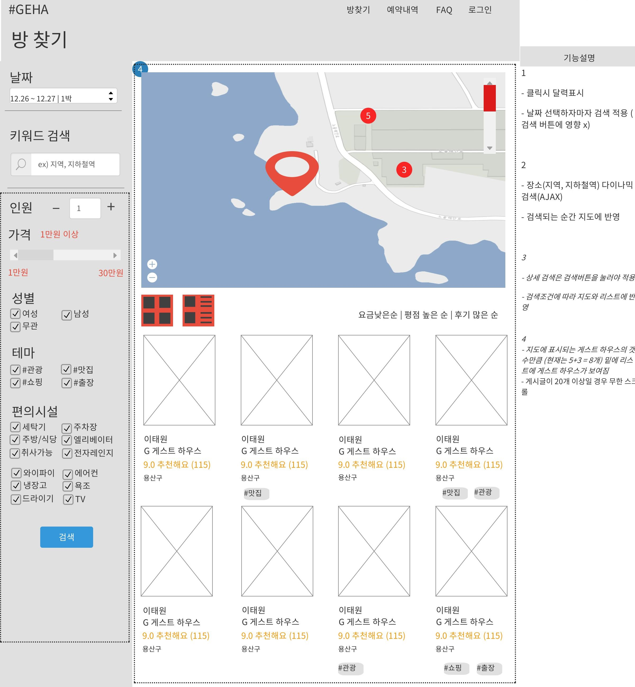
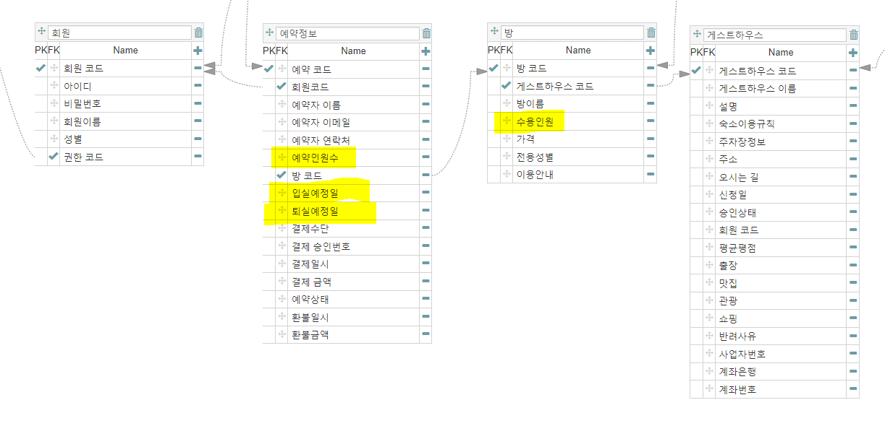

## 문제

* 스토리보드 확인



* 작성중인 ERD 확인



* Input
    1. 날짜&인원을 선택하고 검색버튼을 누른다
    2. `?startdate=2019-01-01&enddate=2019-01-03&person=4` 등의 데이터가 넘어간다
* Output
    1. 조건에 맞는 게스트하우스를 출력한다
    2. 조건 : 게스트하우스가 가지고 있는 방 중에서 하나라도 2019년 1월 1일부터 3일까지 3일동안 4명의 예약가능한 자리가 남아있어야 한다

* 조건에 맞게 검색하기 위해서는 검색한 날짜별로 모든 방의 최대수용인원과 이미예약한 인원을 뺀 값을 계산해야 하는데 어떻게 해야하는지 감이 전혀 오지 않았다.
* 결국 커뮤니티에 질문을...(구루비, Okky, 코드초보스터디카페)

## 해결

* [구루비 질문내용과 마농님의 답변 참고](http://www.gurubee.net/article/80746){:target="_blank"}

* 해결방법
    1. [달력 테이블 만들기 참고](http://nekomimi.tistory.com/722){:target="_blank"}
    2. 샘플 테이블, 데이터 넣기 (회원, 게스트하우스, 방, 예약정보 테이블)
    3. Oracle 답변을 MySQL로 수정

```sql
-- 샘플 테이블 만들기
CREATE TABLE guest_tb
(
    `guestHouseCode`  INT            NOT NULL    AUTO_INCREMENT,
    `guestHouseName`  VARCHAR(45)    NULL,
    PRIMARY KEY (guestHouseCode)
);


-- member_tb Table Create SQL
CREATE TABLE member_tb
(
    `membercode`  INT            NOT NULL    AUTO_INCREMENT,
    `id`          VARCHAR(45)    NULL,
    PRIMARY KEY (membercode)
);


-- room_tb Table Create SQL
CREATE TABLE room_tb
(
    `roomCode`        INT            NOT NULL    AUTO_INCREMENT,
    `guestHouseCode`  INT            NULL,
    `roomName`        VARCHAR(45)    NULL,
    `capacity`        INT            NULL,
    PRIMARY KEY (roomCode)
);

ALTER TABLE room_tb ADD CONSTRAINT FK_room_tb_guestHouseCode_guest_tb_guestHouseCode FOREIGN KEY (guestHouseCode)
 REFERENCES guest_tb (guestHouseCode)  ON DELETE RESTRICT ON UPDATE RESTRICT;


-- booking_tb Table Create SQL
CREATE TABLE booking_tb
(
    `bookingCode`    INT            NOT NULL    AUTO_INCREMENT,
    `memberCode`     INT            NULL,
    `booker`         VARCHAR(45)    NULL,
    `bookingNumber`  INT            NULL,
    `roomCode`       INT            NULL,
    `bookingStart`   DATE           NULL,
    `bookingEnd`     DATE           NULL,
    PRIMARY KEY (bookingCode)
);

ALTER TABLE booking_tb ADD CONSTRAINT FK_booking_tb_memberCode_member_tb_membercode FOREIGN KEY (memberCode)
 REFERENCES member_tb (membercode)  ON DELETE RESTRICT ON UPDATE RESTRICT;
ALTER TABLE booking_tb ADD CONSTRAINT FK_booking_tb_roomCode_room_tb_roomCode FOREIGN KEY (roomCode)
 REFERENCES room_tb (roomCode)  ON DELETE RESTRICT ON UPDATE RESTRICT;

-- 샘플 데이터 넣기
insert into member_tb(id) values('유저1');
insert into member_tb(id) values('유저2');
insert into member_tb(id) values('유저3');
insert into member_tb(id) values('유저4');

select * from member_tb;

insert into guest_tb(guestHouseName) values('게하1');
insert into guest_tb(guestHouseName) values('게하2');
insert into guest_tb(guestHouseName) values('게하3');
insert into guest_tb(guestHouseName) values('게하4');
insert into guest_tb(guestHouseName) values('게하5');


select * from guest_tb;

insert into room_tb(guesthousecode, roomname, capacity) values(1, '방1-1', 3);
insert into room_tb(guesthousecode, roomname, capacity) values(1, '방1-2', 4);
insert into room_tb(guesthousecode, roomname, capacity) values(1, '방1-3', 5);
insert into room_tb(guesthousecode, roomname, capacity) values(2, '방2-1', 3);
insert into room_tb(guesthousecode, roomname, capacity) values(2, '방2-2', 4);
insert into room_tb(guesthousecode, roomname, capacity) values(2, '방2-3', 5);
insert into room_tb(guesthousecode, roomname, capacity) values(3, '방3-1', 3);
insert into room_tb(guesthousecode, roomname, capacity) values(3, '방3-2', 4);
insert into room_tb(guesthousecode, roomname, capacity) values(3, '방3-3', 5);

select * from room_tb;

insert into booking_tb(membercode, booker, bookingnumber, roomcode, bookingstart, bookingend) values(1, '예약자1', 3, 1, '2019-01-01', '2019-01-03');
insert into booking_tb(membercode, booker, bookingnumber, roomcode, bookingstart, bookingend) values(2, '예약자2', 4, 2, '2019-01-02', '2019-01-04');
insert into booking_tb(membercode, booker, bookingnumber, roomcode, bookingstart, bookingend) values(3, '예약자3', 5, 3, '2019-01-04', '2019-01-06');
insert into booking_tb(membercode, booker, bookingnumber, roomcode, bookingstart, bookingend) values(3, '예약자4', 3, 4, '2019-01-06', '2019-01-08');
```


```sql
-- 달력 만들기 2019년 1년
create table t(n int);
insert into t values(1);

--365일을 만들거라서 1의 개수를 365 이상되도록 설정
insert into t select * from t; --2
insert into t select * from t; --4
insert into t select * from t; --8
insert into t select * from t; --16
insert into t select * from t; --32
insert into t select * from t; --64
insert into t select * from t; --128
insert into t select * from t; --256
insert into t select * from t; --512

create table date_t
	select d, date_format(d, '%Y%m%d') from (
		select @rnum:=@rnum+1 as rownum, date(adddate('2019-01-01', interval @rnum day)) as d
		from (select @rnum:=-1) r, t
		) t
where year(d) < 2020;

select * from date_t;

-- 답변내용 수정후 적용
select b.roomcode,
    b.roomname,
    b.capacity,
     a.d,
    sum(c.bookingnumber) as '예약인원수'
     , b.capacity - ifnull(sum(c.bookingnumber),0) as '예약가능인원'
     from (select d
     from date_t
     where d between '2019-01-01' and '2019-01-03'
     ) a
     cross join
     (select x.roomcode, x.roomname, x.capacity
     from room_tb x
     inner join guest_tb y
     on x.guesthousecode = y.guesthousecode
     where 1=1
     ) b
     left outer join booking_tb c
     on b.roomcode = c.roomcode
     and a.d between c.bookingstart and c.bookingend
     group by b.roomcode, b.roomname, b.capacity, a.d
having b.capacity - ifnull(SUM(c.bookingnumber),0) >= 4;
```

## 이후의 과제

* 사용한 MySQL 쿼리문 전부 해석하고 이해하기
* 더 사용된 테이블 erd에 추가
* 이 쿼리 사용해서 나온 방을 하나라도 가지고 있는 게스트하우스를 출력시키기
