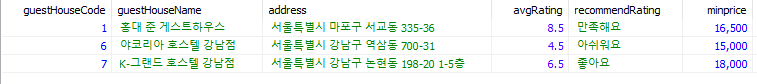

* 감격스럽다

```sql
-- 검색 쿼리 완성 --
-- 날짜 19-01-01 ~ 19-01-03
-- 인원 4명
-- 가격 10000 ~ 80000
-- 성별 여성전용, 남성전용, 무관 모두 선택한 경우
-- 테마 맛집
-- 편의시설 1,3,5,7 (세탁기, 주방/식당, 취사가능, 와이파이)
select distinct gh.guestHouseCode, gh.guestHouseName, gh.address, gh.avgRating, gr.recommendRating,
	   ghmin.minprice, gh.businessTrip, gh.gourmet, gh.trip, gh.shopping,
	   rvc.reviewCnt, fi.originalName
from guestHouse_tb gh
	left join file_tb fi
	on fi.guestHouseCode = gh.guestHouseCode
	and fi.roomCode = 0
	and fi.isMainImage = 1
	join grade_tb gr
	on gr.minRating <= gh.avgRating and gh.avgRating <= gr.maxRating
	join
		(
		select gh.guestHouseCode, MIN(rm.charge) "minprice"
		from guestHouse_tb gh
			join room_tb rm
			on rm.guestHouseCode = gh.guestHouseCode
			and rm.gender in ('F', 'M', 'N')
		group by gh.guestHouseCode
		) ghmin
	on ghmin.guestHouseCode = gh.guestHouseCode
	left join
		(
		select gh.guestHouseCode, count(rv.reviewNo) "reviewCnt"
		from guestHouse_tb gh
			join room_tb rm
			on rm.guestHouseCode = gh.guestHouseCode
			left join booking_tb bk
			on bk.roomCode = rm.roomCode
			left join review_tb rv
			on rv.bookingCode = bk.bookingCode
		group by gh.guestHouseCode
		) rvc
	on rvc.guestHouseCode = gh.guestHouseCode
	join guestHouse_has_facility_tb ghf
	on gh.guestHouseCode = ghf.guestHouseCode
	join
		(select ghf.guestHouseCode, COUNT(ghf.facilityCode)
		from guestHouse_has_facility_tb ghf
		where ghf.facilityCode in (1, 3, 5, 7)
		group by ghf.guestHouseCode
		having COUNT(ghf.facilityCode) = 4 -- 편의시설 선택 갯수 html에서 가져올 수 있는지 확인
		) fa
	on fa.guestHouseCode = gh.guestHouseCode
	join room_tb rm
	on rm.guestHouseCode = gh.guestHouseCode
	join
		(select t.roomCode, count(t.d) "countdate"
		from
		(select b.roomCode, a.d
		from
			(select d
			from date_t
			where d between '2019-01-01' and '2019-01-03'
			) a
			cross join
			room_tb b
			left join booking_tb c
				on b.roomCode = c.roomCode
				and a.d between c.bookingStart and c.bookingEnd
		group by b.roomCode, b.roomName, b.capacity, a.d
		having b.capacity - ifnull(sum(c.bookingNumber), 0) >= 4
		) t
		group by t.roomCode
		having count(t.d) = TIMESTAMPDIFF(DAY, '2019-01-01', '2019-01-03') + 1
		) dp
	on rm.roomCode = dp.roomCode
where ghmin.minprice between 10000 and 80000
and gh.gourmet = 1
order by gh.guestHouseCode
;
```

* 출력된 데이터



### 이후에 할 일

1. 확인
	* 위의 주석에서 `-- 편의시설 선택 갯수 html에서 가져올 수 있는지 확인` 을 적어놓은 것은
	* checkbox 에서 데이터를 넘길 때 여러개를 선택한 경우
	* `?facility=1&facility=3&facility=5&facility=7` 이런식으로 넘어가는데
	* 컨트롤러 혹은 마이바티스에서 선택한 개수가 4개라는 것을 알 수 있는지 확인해야 한다

2. 선택
	* 사실 완전한 완성은 아니다.
	* 키워드 검색이 들어 있지는 않기 때문인데, 여러가지 고려사항이 남아있다.
		* 예를들어 키워드 검색에 강남을 입력 했을 때 <a href="https://www.woozoo.kr/houses" target="_blank">우주</a> 처럼
		* 지도가 강남으로 포커스되고
		* 그 지도안에 들어있는 모든 게스트하우스를 밑에 나타내게 하고 싶었던 것인데
		* 위의 쿼리문에 추가할 경우 DB로 날려서 새로고침 되어야 하기 때문
		* 애초에 우주와 여기어때를 둘 다 참고해서 UI가 섞인게 원인
			1. 우주처럼 나타내는 것을 포기하고 쿼리문에 추가할 것인지
			2. 키워드 검색의 위치를 바꾸고 ajax 요청으로 처리할 것인지 선택해야한다

3. 성능
	* 일단 꾸역꾸역 만들기는 했는데
	* 인덱스를 사용한 것도아니고 (들어만 보고 아직 이해를 잘 못하기도 했다)
	* 이것저것 생각나는 대로 합친 것이어서 중복이 많을 수도 있고
	* 나는 모르지만 더 개선할 부분이 분명히 있다
	* 그래서 구루비에 다시 물어볼 예정
