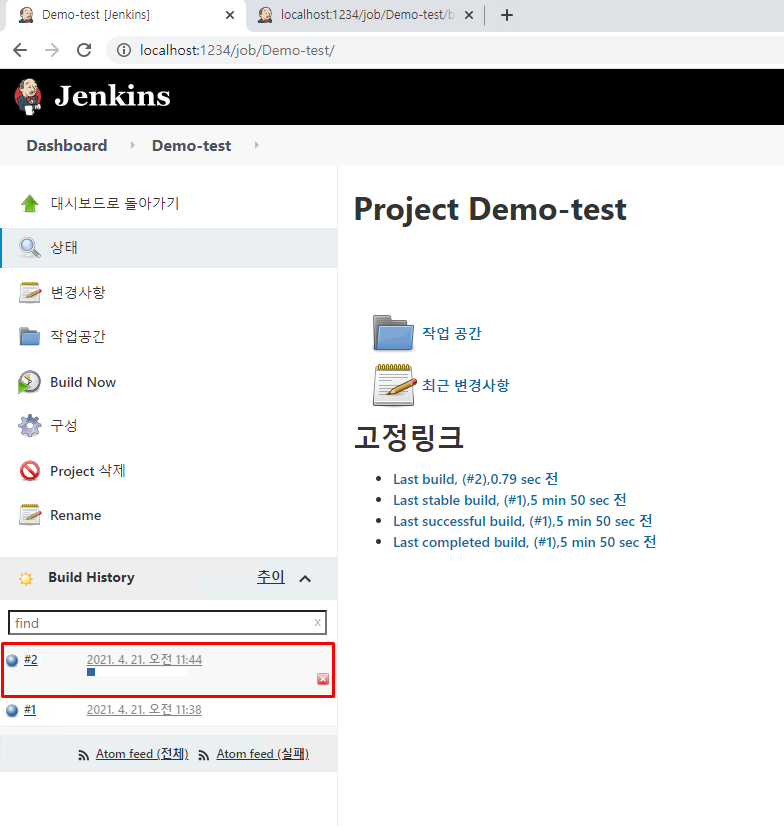

github, gitlab등의 웹호스팅 기반 서비스를 사용한다면 젠킨스와 연동하기 쉬운데요. 여러가지 이유로 설치형 git을 사용해야만 하는 경우 CI를 어떤식으로 진행하는지 정리해봤습니다.

세 줄 요약
1. 젠킨스 빌드를 원격으로 유발하는 URL 설정
2. git이 설치된 서버에 post-receive git hooks 설정
3. post-receive script 코드에 1번 URL을 연결

## 1. 젠킨스 설치
* docker등의 가상환경에서 구축하는 방법도 있지만 지금은 windows 환경에서 설치해보겠습니다.

### 1.1 설치파일 다운로드

https://www.jenkins.io/ 에서 설치파일을 다운로드합니다.


port를 설정합니다. 이번에는 1234로 설정하겠습니다.


JDK 설정을 해줘야하는데 공식사이트를 잘 읽어보면 8과 11만 지원한다고 되어 있습니다.
나중에는 어떻게 바뀔지 모르니 공식 문서를 꼭 정독하시고 적절한 JDK 버전을 설정해주세요.


localhost:1234에 접속해 보겠습니다.


빨간색 글씨로 Unlock Jenkins라고 쓰여 있습니다.

표시된 주소에 들어가면 초기 AdminPassword가 적혀있습니다.


비밀번호를 붙여넣고 Continue 버튼을 눌러주세요.


Install Suggested plugins를 클릭해서 추천하는 plugin들을 설치합니다.


이번 예제에서는 프로젝트를 Gradle로 빌드하기 때문에 Gradle plugin이 필요한데 이때 설치가 됩니다.
설치가 완료되면 Create First Admin User 화면이 뜹니다. 사용하실 계정을 만들어 주세요.

### 1.2 Jenkins Item 추가하기 (Demo-test)


새로운 Item 버튼을 클릭합니다.


Freestyle project 선택후 OK 클릭


소스코드 관리에서 Git을 선택하고 빌드하려고 하는 Repository URL을 입력합니다.
에러가 나는 이유는 Credentials가 없기 때문인데 Add버튼을 클릭한 후 Kind에 Username with password로 선택한 후 로그인 아이디와 패스워드를 입력합니다.


Credentials를 다시 클릭하면 Add한 계정이 들어있습니다. 클릭했을 때 에러가 사라진다면 성공입니다.


Branches to build 에서는 build할 branch를 설정할 수 있습니다.


빌드 유발 -> 빌드를 원격으로 유발을 클릭하고 토큰을 지정해줘야 합니다.
나중에는 복잡한 토큰을 입력하는게 좋겠지만. 지금은 abc라고 설정해보겠습니다.
이렇게 설정하게 되면 `http://jenkins_url/job/Demo-test/build?token=abc` 의 주소로 Get 요청을 보내게 되면 Jenkins 빌드가 시작됩니다.


Build -> Invoke Gradle script를 클릭합니다.
Use Gradle Wrapper, Make gradlew executable 선택합니다.
Wrapper location -> graddle wrapper가 들어 있는 경로를 설정합니다.
프로젝트 내에 gradle 폴더가 루트에 있다면 `${workspace}`라고 입력해주면 됩니다.


Tasks에 필요한 task들을 나열합니다.

저장을 클릭하고 대시보드로 돌아가면 Item이 추가된 것을 확인할 수 있습니다. (방금 한 설정을 수정하려면 Demo-test 부분 클릭 -> 구성으로 들어가면 됩니다.)


## 2 Jenkins 빌드해보기 (수동)

### 2.1 Build Now 버튼을 클릭

jenkins로 빌드하는 가장 간단한 방법은 Build Now 버튼을 클릭하는 것입니다.


Build History에 새로운 작업이 생긴다면 빌드요청이 잘 실행된 것입니다.

### 2.2 원격으로 빌드 유발 (Http Get 요청)

Item을 만들 때 원격으로 빌드 유발 설정을 했기 때문에 Get요청을 통해 원격으로 빌드를 유발시킬 수 있습니다.
새탭을 열고 아래의 URL을 입력해 보겠습니다.
`http://localhost:1234/job/Demo-test/build?token=abc`


아무화면도 안뜨지만 다시 Jenkins로 돌아가보면



새로운 빌드가 진행되는 것을 확인할 수 있습니다.

### 2.3 작업 공간에서 빌드 결과 확인


build/libs 폴더로 들어가면 현재 무슨버전으로 프로젝트가 빌드되었는지 확인할 수 있습니다.
build.gradle 에서 버전을 하나씩 올려주면 빌드가 잘 되었는지 파악하기 쉽습니다.

## 3. Jenkins 포트포워딩, 방화벽 설정

1234포트를 git이 설치된 컴퓨터에서도 요청 해야하기 때문에 포트포워딩과 방화벽 설정을 해줘야합니다.
각자 공유기에 맞게 설정을 하시면 됩니다.

## 4. Git hooks 설정

### 4.1 Git hooks 설명

Git은 어떤 이벤트가 생겼을 때 자동으로 특정 스크립트를 실행하도록 하는 Hooks라는 기능을 지원합니다.

훅은 크게 클라이언트 훅과 서버 훅으로 나뉘는 데요. 깃의 local과 remote로 생각하시면 편합니다.
자세한 설명은 아래 링크로 대신하겠습니다.
[Git Hooks - git-scm.com](https://git-scm.com/book/ko/v2/Git%EB%A7%9E%EC%B6%A4-Git-Hooks){:target="_blank"}

많은 훅 중에서 저희가 사용하고 싶은건 post-receive입니다. remote repository의 특정 브랜치에 누군가 push했을 때! 젠킨스 빌드를 하고 싶기 때문이죠.
update 스크립트는 각 브랜치마다 한 번씩 실행되기 때문에 지금 상황에서는 적합하지 않습니다.

### 4.2 post-receive hooks를 git 서버에 설정
* 회사에서 설치형 git을 사용한다면. 설치된 컴퓨터에 접근이 가능해야합니다.
* 클라이언트훅이 아닌 서버 훅이기 때문에 실제로 git server에 저장된 경로안에 직접 hook을 설정해 줘야하기 때문입니다.

hook을 설정하려는 repository/hooks 경로로 접근합니다.
`xxx\Repositories\Demo\hooks`
폴더에 post-receive 파일을 만듭니다.

아래의 코드를 입력 후 저장합니다.

* branch 이름 가져오기
* branch가 master라면 젠킨스 빌드 원격 요청
* jenkins id, password를 curl -u 옵션에 입력해야함
* curl -u id:password -X GET "http://xxx:1234/job/Demo-test/build?token=abc"

```shell
#!/bin/bash
while read oldrev newrev refname
do
	branch=$(git rev-parse --symbolic --abbrev-ref $refname)

	echo "branch name is ${branch}"

	if [ "$branch" == "master" ]
	then
		echo "jenkins build start"
		curl -u id:password -X GET "http://xxx:1234/job/Demo-test/build?token=abc"
	else
		echo "jenkins will not build"
	fi
done
```

### 4.3 master 브랜치에 push했을 때 빌드가 잘 되는지 테스트

1. hook이 잘 걸렸는지?
2. branch name이 master일때만 빌드 되는지?
2. curl 계정 정보 오류는 없는지?
3. jenkins에 새로운 빌드가 생기는지?

모두 성공했을 때


Build History에 새로운 빌드가 생긴다면 성공입니다.

### 마무리

지금까지 post-receive git hooks를 이용한 Jenkins CI를 알아봤습니다.

설치형 git server를 사용하는 경우에도 CI를 할 수 있다는 측면에서 의미가 있는 삽질이었습니다.

이후에는

* 메신저 API를 활용한 빌드 결과 전송
* 빌드한 결과물 자동 배포 (CD)

에 대해서도 포스팅해보도록 하겠습니다.
