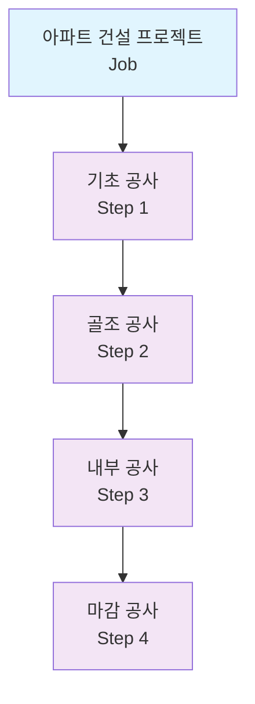
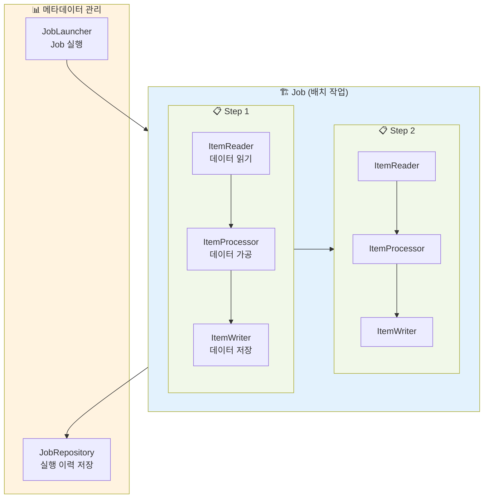
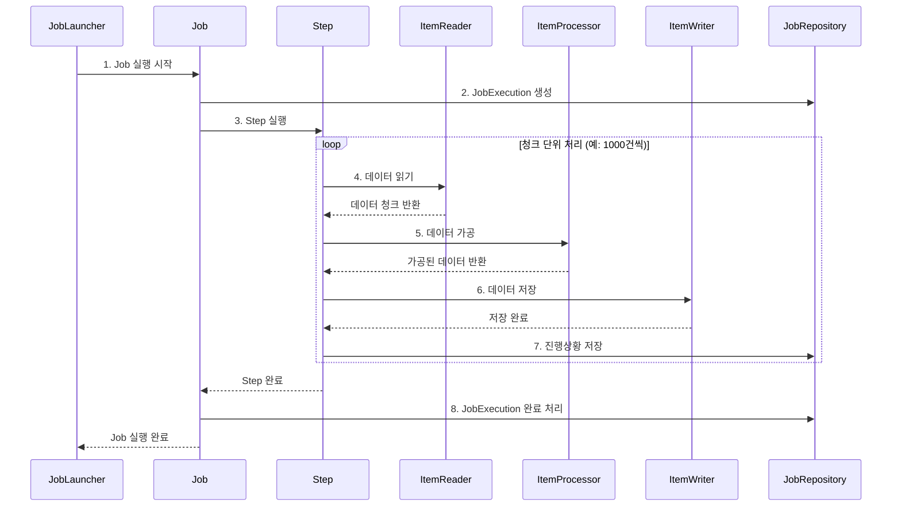

안녕하세요! 오늘부터 Spring Batch를 제로부터 실무까지 다루는 마스터 클래스 시리즈를 시작합니다. 🚀

이 시리즈는 1년차 백엔드 개발자도 쉽게 이해할 수 있도록, Kotlin과 Spring Boot 최신 버전을 사용하여 실무 경험을 바탕으로 차근차근 설명해드릴 예정입니다.

## 📌 이런 경험 있으신가요?

입사한 지 얼마 안 된 신입 개발자 A씨의 하루를 들여다볼까요?

> "A씨, 매일 새벽 2시에 전날 주문 데이터를 집계해서 리포트 만드는 기능 개발해주세요!"

A씨는 열심히 구글링해서 `@Scheduled` 어노테이션을 찾아냅니다.

```kotlin
@Component
class OrderReportScheduler(
    private val orderRepository: OrderRepository
) {
    
    @Scheduled(cron = "0 0 2 * * *")  // 매일 새벽 2시
    fun createDailyReport() {
        // 1. 어제 날짜의 모든 주문 조회
        val yesterday = LocalDate.now().minusDays(1)
        val orders = orderRepository.findByDate(yesterday)
        
        // 2. 주문 데이터 집계
        orders.forEach { order ->
            // 복잡한 비즈니스 로직...
        }
        
        // 3. 리포트 생성
        // 4. 이메일 발송
    }
}
```

"완성! 이제 매일 새벽 2시에 리포트가 만들어질 거야!" 😎

### 🤔 그런데 문제가 생기기 시작합니다...

#### 문제 1: "어? 오늘 리포트가 안 왔네요?"
- 새벽 2시에 서버가 잠깐 다운됐었다면?
- 실행 중에 에러가 발생했다면?
- 어디까지 처리됐는지 어떻게 알지?

#### 문제 2: "주문이 100만 건인데... OutOfMemoryError가..."
- 모든 데이터를 한 번에 메모리에 올릴 수 없다면?
- 처리 중간에 실패하면 처음부터 다시?

#### 문제 3: "이번 달 리포트만 다시 돌려주세요"
- 특정 날짜의 배치만 재실행하려면?
- 동일한 배치가 중복 실행되면?

#### 문제 4: "처리 속도가 너무 느려요"
- 순차 처리만 가능한가?
- 병렬 처리는 어떻게?

## 🎯 Spring Batch가 해결해주는 것들

Spring Batch는 위의 모든 문제를 우아하게 해결해주는 **대용량 배치 처리 프레임워크**입니다.

### 🔄 재시작 가능 (Restartable)

```kotlin
@Bean
fun orderReportJob(jobRepository: JobRepository): Job {
    return JobBuilder("orderReportJob", jobRepository)
        .start(step1())
        .build()
}
```

배치가 실패하면? 실패한 지점부터 다시 시작할 수 있습니다!

### 📊 청크 단위 처리 (Chunk Processing)

```kotlin
@Bean
fun processOrderStep(
    jobRepository: JobRepository,
    transactionManager: PlatformTransactionManager
): Step {
    return StepBuilder("processOrderStep", jobRepository)
        .chunk<Order, OrderReport>(1000, transactionManager)  // 1000건씩 처리
        .reader(orderReader())
        .processor(orderProcessor())
        .writer(orderWriter())
        .build()
}
```

100만 건도 문제없어요! 1000건씩 나눠서 처리합니다.

### 🔍 실행 이력 관리

| JOB_INSTANCE_ID | JOB_NAME | STATUS | START_TIME | END_TIME |
|-----------------|----------|---------|------------|----------|
| 1 | orderReportJob | COMPLETED | 2025-07-26 02:00:00 | 2025-07-26 02:15:00 |
| 2 | orderReportJob | FAILED | 2025-07-27 02:00:00 | 2025-07-27 02:05:00 |
| 3 | orderReportJob | COMPLETED | 2025-07-27 03:00:00 | 2025-07-27 03:14:00 |

모든 실행 이력이 자동으로 저장됩니다!

### ⚡ 병렬 처리 지원

```kotlin
@Bean
fun parallelStep(
    jobRepository: JobRepository,
    partitioner: Partitioner
): Step {
    return StepBuilder("parallelStep", jobRepository)
        .partitioner("workerStep", partitioner)
        .gridSize(4)  // 4개 스레드로 병렬 처리
        .build()
}
```

## 📊 Spring Batch vs 일반 스케줄러

| 구분 | 일반 스케줄러 (@Scheduled) | Spring Batch |
|------|---------------------------|--------------|
| **재시작** | ❌ 처음부터 다시 실행 | ✅ 실패 지점부터 재시작 |
| **대용량 처리** | ❌ 메모리 이슈 발생 가능 | ✅ 청크 단위 처리 |
| **실행 이력** | ❌ 별도 구현 필요 | ✅ 자동 저장 |
| **트랜잭션** | ❌ 전체 롤백 위험 | ✅ 청크 단위 트랜잭션 |
| **병렬 처리** | ❌ 복잡한 구현 필요 | ✅ 간단한 설정으로 가능 |
| **모니터링** | ❌ 별도 구현 필요 | ✅ 기본 제공 |
| **예외 처리** | ❌ try-catch로 직접 | ✅ Skip, Retry 정책 |

## 🏗️ Spring Batch 아키텍처 Overview

Spring Batch의 핵심 구조를 아파트 건설에 비유해볼게요!

### 🏢 아파트 건설 프로젝트 = Job



### 핵심 컴포넌트

#### 1. **Job (작업)**
- 전체 배치 처리 과정
- 예: "일일 주문 리포트 생성 작업"

#### 2. **Step (단계)**
- Job을 구성하는 단위 작업
- 예: "주문 조회 → 집계 → 리포트 생성"

#### 3. **ItemReader**
- 데이터를 읽어오는 역할
- 예: DB에서 주문 데이터 읽기

#### 4. **ItemProcessor**
- 읽은 데이터를 가공하는 역할
- 예: 주문 데이터를 리포트 형태로 변환

#### 5. **ItemWriter**
- 가공된 데이터를 저장하는 역할
- 예: 리포트를 파일로 저장

### Spring Batch 핵심 컴포넌트 구조



### 실행 흐름 다이어그램



## 🛠️ 개발 환경 세팅

이제 직접 Spring Batch를 사용해볼 준비를 해봅시다!

### 1. 프로젝트 생성

Spring Initializr(https://start.spring.io)에서:
- Spring Boot 3.2.x
- Kotlin
- Java 17
- Dependencies:
  - Spring Batch
  - Spring Data JPA
  - H2 Database (학습용)

### 2. 의존성 추가 (build.gradle.kts)

```kotlin
dependencies {
    implementation("org.springframework.boot:spring-boot-starter-batch")
    implementation("org.springframework.boot:spring-boot-starter-data-jpa")
    implementation("org.jetbrains.kotlin:kotlin-reflect")
    runtimeOnly("com.h2database:h2")
    testImplementation("org.springframework.batch:spring-batch-test")
}
```

### 3. 배치 활성화

```kotlin
@SpringBootApplication
@EnableBatchProcessing  // Spring Boot 3.x에서는 이 어노테이션이 필수가 아님
class BatchApplication

fun main(args: Array<String>) {
    runApplication<BatchApplication>(*args)
}
```

> 💡 **Spring Boot 3.x 변경사항**: Spring Boot 3.x부터는 `@EnableBatchProcessing`이 자동으로 적용됩니다. 커스텀 설정이 필요한 경우에만 명시적으로 사용하세요.

### 4. 데이터베이스 설정 (application.yml)

```yaml
spring:
  datasource:
    url: jdbc:h2:mem:testdb
    driver-class-name: org.h2.Driver
    username: sa
    password:
    
  batch:
    jdbc:
      initialize-schema: always  # 배치 메타 테이블 자동 생성
    job:
      enabled: false  # 애플리케이션 시작 시 자동 실행 방지
    
  h2:
    console:
      enabled: true  # H2 콘솔 활성화
      
  jpa:
    hibernate:
      ddl-auto: create-drop
    show-sql: true
```

### 5. 첫 번째 Job 맛보기

```kotlin
@Configuration
class HelloBatchConfig {
    
    @Bean
    fun helloJob(
        jobRepository: JobRepository,
        helloStep: Step
    ): Job {
        return JobBuilder("helloJob", jobRepository)
            .start(helloStep)
            .build()
    }
    
    @Bean
    fun helloStep(
        jobRepository: JobRepository,
        transactionManager: PlatformTransactionManager
    ): Step {
        return StepBuilder("helloStep", jobRepository)
            .tasklet({ _, _ ->
                println("Hello, Spring Batch! 🎉")
                RepeatStatus.FINISHED
            }, transactionManager)
            .build()
    }
}
```

### 6. Job 실행하기

```kotlin
@RestController
@RequestMapping("/batch")
class BatchController(
    private val jobLauncher: JobLauncher,
    private val helloJob: Job
) {
    
    @PostMapping("/run")
    fun runBatch(): String {
        val jobParameters = JobParametersBuilder()
            .addLocalDateTime("requestTime", LocalDateTime.now())
            .toJobParameters()
            
        val execution = jobLauncher.run(helloJob, jobParameters)
        
        return "Batch job started with id: ${execution.id}"
    }
}
```

실행하면:
```
2025-07-27 10:00:00 INFO  --- [main] o.s.b.c.l.support.SimpleJobLauncher : Job: [helloJob] launched
2025-07-27 10:00:00 INFO  --- [main] o.s.batch.core.job.SimpleStepHandler : Executing step: [helloStep]
Hello, Spring Batch! 🎉
2025-07-27 10:00:00 INFO  --- [main] o.s.b.c.l.support.SimpleJobLauncher : Job: [helloJob] completed
```

## 🎯 정리

오늘은 Spring Batch가 무엇이고 왜 필요한지 알아봤습니다.

### 핵심 정리
1. **Spring Batch는** 대용량 데이터를 안정적으로 처리하기 위한 프레임워크
2. **일반 스케줄러와 달리** 재시작, 청크 처리, 병렬 처리 등을 지원
3. **Job > Step > Reader/Processor/Writer** 구조로 구성
4. **실행 이력이 자동으로 관리**되어 모니터링이 쉬움
5. **Spring Boot 3.x + Kotlin**으로 더욱 간결한 코드 작성 가능

---
