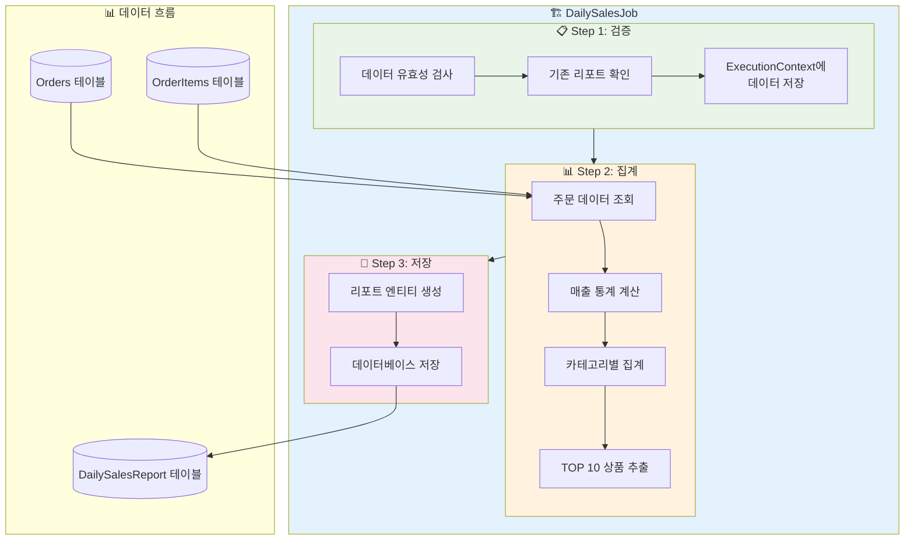
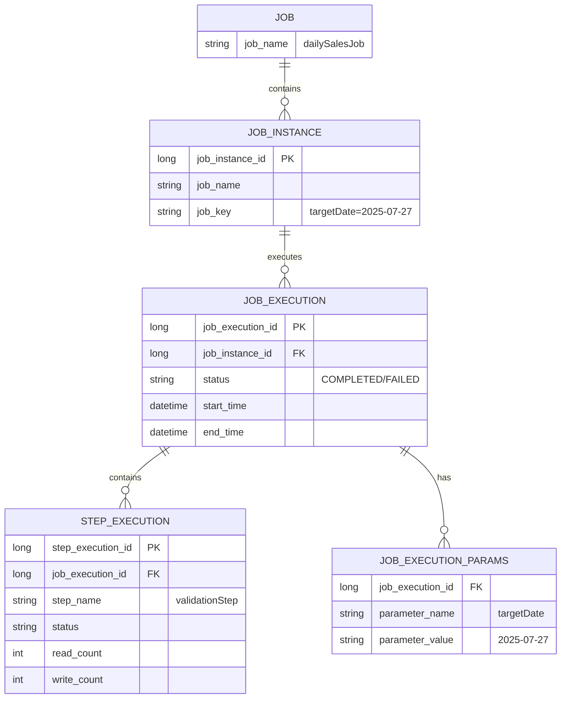
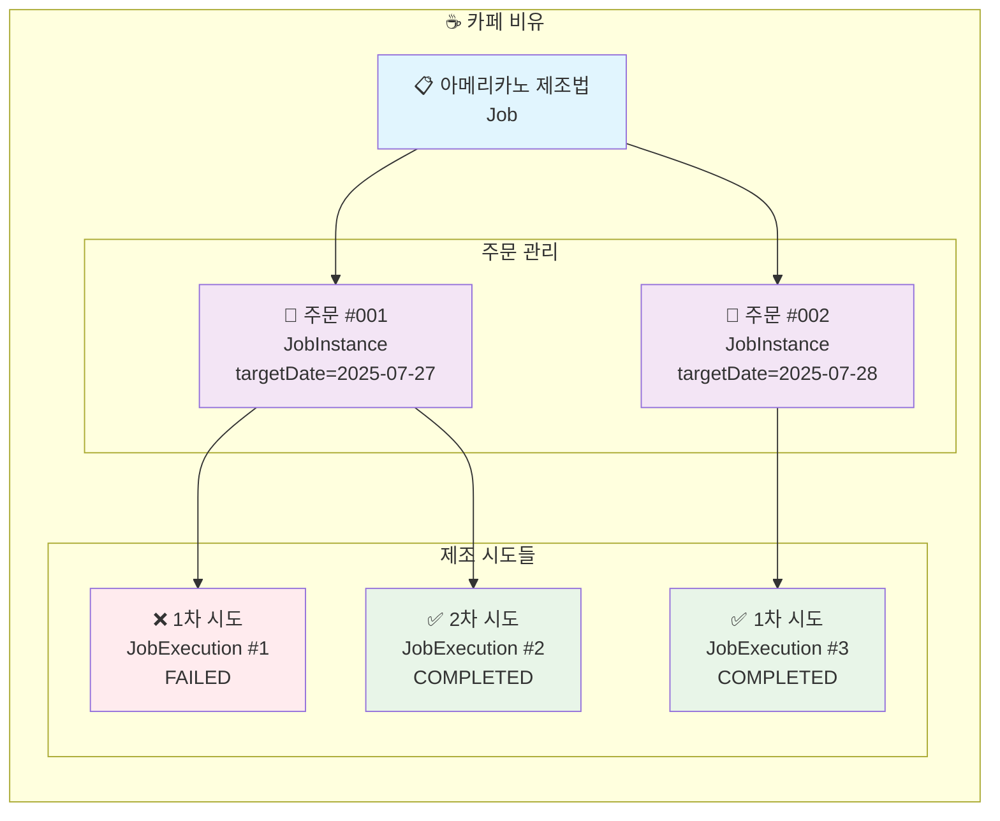
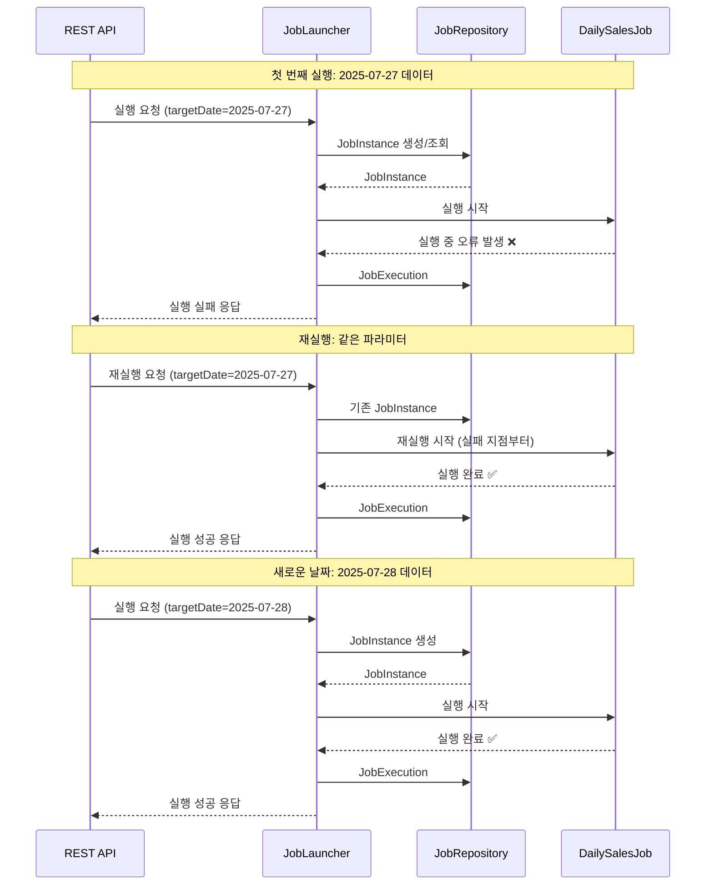

지난 Chapter 1에서 Spring Batch가 무엇이고 왜 필요한지 알아봤습니다. 이번 시간에는 직접 Job과 Step을 만들어보고, JobParameters를 통해 동적으로 배치를 실행하는 방법을 배워보겠습니다! 🚀

## 🎯 들어가며 - 실무 시나리오

여러분이 이커머스 회사의 백엔드 개발자라고 상상해보세요. 팀장님이 다음과 같은 요구사항을 전달합니다.

> "매일 자정에 전날 매출을 집계하는 배치를 만들어주세요. 카테고리별, 상품별로 통계를 내고, 가끔은 특정 날짜를 지정해서 재집계할 수도 있어야 해요!"

오늘 우리가 만들 **"일일 매출 집계 배치"**의 요구사항은 다음과 같습니다:

### 📋 요구사항
1. **매일 새벽 1시**에 전날 매출 데이터 자동 집계
2. **카테고리별** 매출 통계 생성
3. **상품별 TOP 10** 추출
4. 집계 결과를 `daily_sales_report` 테이블에 저장
5. **특정 날짜를 지정**해서 재집계 가능해야 함

자, 그럼 시작해볼까요? 💪

## 🏗️ 프로젝트 세팅과 도메인 설계

### 프로젝트 구조

```
sales-batch-project/
├── src/main/kotlin/
│   ├── com.example.salesbatch/
│   │   ├── domain/           # 엔티티
│   │   ├── repository/       # JPA Repository
│   │   ├── batch/           # 배치 관련 설정
│   │   │   ├── config/      # Job, Step 설정
│   │   │   ├── tasklet/     # Tasklet 구현체
│   │   │   └── listener/    # Job/Step 리스너
│   │   └── controller/      # 배치 실행 API
│   └── resources/
│       └── application.yml
```

### 도메인 엔티티 설계

먼저 주문 관련 엔티티들을 만들어봅시다.

**필요한 Import 문들:**
```kotlin
import org.hibernate.annotations.JdbcTypeCode
import org.hibernate.type.SqlTypes
import org.slf4j.LoggerFactory
import java.math.BigDecimal
import java.time.LocalDate
import java.time.LocalDateTime
import javax.persistence.*
```

> 💡 **주의사항**: JPA Entity에서는 `data class`보다 일반 `class` 사용을 권장합니다. `equals`, `hashCode`, `toString` 등을 Entity 특성에 맞게 커스터마이징해야 하기 때문입니다.

```kotlin
// Order.kt - 주문 정보
@Entity
@Table(name = "orders")
class Order(
    @Id
    @GeneratedValue(strategy = GenerationType.IDENTITY)
    val id: Long = 0,
    
    val orderNumber: String,
    
    @Column(name = "order_date")
    val orderDate: LocalDate,
    
    @Column(name = "order_time")
    val orderTime: LocalDateTime,
    
    val customerName: String,
    
    @Enumerated(EnumType.STRING)
    val status: OrderStatus,
    
    @OneToMany(mappedBy = "order", cascade = [CascadeType.ALL])
    val orderItems: MutableList<OrderItem> = mutableListOf()
) {
    fun getTotalAmount(): BigDecimal {
        return orderItems.sumOf { it.getTotalPrice() }
    }
}

// OrderItem.kt - 주문 상품 정보
@Entity
@Table(name = "order_items")
class OrderItem(
    @Id
    @GeneratedValue(strategy = GenerationType.IDENTITY)
    val id: Long = 0,
    
    @ManyToOne(fetch = FetchType.LAZY)
    @JoinColumn(name = "order_id")
    val order: Order,
    
    val productName: String,
    val category: String,
    val quantity: Int,
    val unitPrice: BigDecimal
) {
    fun getTotalPrice(): BigDecimal = unitPrice * quantity.toBigDecimal()
}

// DailySalesReport.kt - 일별 매출 리포트
@Entity
@Table(name = "daily_sales_report")
class DailySalesReport(
    @Id
    @GeneratedValue(strategy = GenerationType.IDENTITY)
    val id: Long = 0,
    
    @Column(unique = true)
    val reportDate: LocalDate,
    
    val totalSales: BigDecimal,
    val totalOrders: Int,
    val averageOrderValue: BigDecimal,
    
    @JdbcTypeCode(SqlTypes.JSON)
    @Column(columnDefinition = "json")
    val categoryStats: Map<String, BigDecimal>,
    
    @JdbcTypeCode(SqlTypes.JSON)
    @Column(columnDefinition = "json")
    val topProducts: List<ProductStat>,
    
    val createdAt: LocalDateTime = LocalDateTime.now()
)

// ProductStat.kt - 상품 통계
data class ProductStat(
    val productName: String,
    val totalSales: BigDecimal,
    val quantity: Int
)
```

## 🎨 첫 번째 Job 만들기 - Step by Step

이제 본격적으로 Spring Batch Job을 만들어봅시다!

### 📊 일일 매출 집계 배치 아키텍처



### JobConfiguration 생성

```kotlin
@Configuration
class DailySalesJobConfig(
    private val jobRepository: JobRepository,
    private val transactionManager: PlatformTransactionManager
) {
    
    companion object {
        private val log = LoggerFactory.getLogger(DailySalesJobConfig::class.java)
    }
    
    @Bean
    fun dailySalesJob(
        validationStep: Step,
        aggregationStep: Step,
        reportStep: Step
    ): Job {
        return JobBuilder("dailySalesJob", jobRepository)
            .incrementer(RunIdIncrementer())  // 같은 파라미터로도 재실행 가능
            .start(validationStep)
            .next(aggregationStep)
            .next(reportStep)
            .listener(jobExecutionListener())
            .build()
    }
    
    @Bean
    fun jobExecutionListener(): JobExecutionListener {
        return object : JobExecutionListener {
            override fun beforeJob(jobExecution: JobExecution) {
                log.info("🚀 일일 매출 집계 배치 시작!")
                log.info("Job Parameters: ${jobExecution.jobParameters}")
            }
            
            override fun afterJob(jobExecution: JobExecution) {
                val duration = Duration.between(
                    jobExecution.startTime,
                    jobExecution.endTime ?: LocalDateTime.now()
                )
                log.info("✅ 배치 완료! 소요시간: ${duration.seconds}초")
                log.info("최종 상태: ${jobExecution.status}")
            }
        }
    }
}
```

### 💡 Spring Boot 3.x 변경사항

Spring Boot 3.x에서는 `JobBuilderFactory`와 `StepBuilderFactory`가 deprecated되었습니다!

```kotlin
// ❌ Spring Boot 2.x (이전 방식)
@Autowired
private lateinit var jobBuilderFactory: JobBuilderFactory

fun myJob(): Job {
    return jobBuilderFactory.get("myJob")
        .start(step1())
        .build()
}

// ✅ Spring Boot 3.x (새로운 방식)
fun myJob(jobRepository: JobRepository): Job {
    return JobBuilder("myJob", jobRepository)
        .start(step1())
        .build()
}
```

## 📝 Step 깊이 이해하기

Step은 배치 작업의 실제 처리 단위입니다. Tasklet 방식으로 시작해봅시다!

### Step 1: 데이터 검증 Step

```kotlin
@Configuration
class ValidationStepConfig(
    private val jobRepository: JobRepository,
    private val transactionManager: PlatformTransactionManager,
    private val orderRepository: OrderRepository,
    private val reportRepository: DailySalesReportRepository
) {
    
    companion object {
        private val log = LoggerFactory.getLogger(ValidationStepConfig::class.java)
    }
    
    @Bean
    fun validationStep(): Step {
        return StepBuilder("validationStep", jobRepository)
            .tasklet(validationTasklet(), transactionManager)
            .build()
    }
    
    @Bean
    @StepScope  // JobParameters를 사용하기 위해 필수!
    fun validationTasklet(
        @Value("#{jobParameters['targetDate']}") targetDate: LocalDate?
    ): Tasklet {
        return Tasklet { contribution, chunkContext ->
            log.info("📋 Step 1: 데이터 검증 시작")
            
            // targetDate가 없으면 어제 날짜 사용
            val processDate = targetDate ?: LocalDate.now().minusDays(1)
            log.info("처리할 날짜: $processDate")
            
            // 1. 해당 날짜에 주문이 있는지 확인
            val orderCount = orderRepository.countByOrderDate(processDate)
            if (orderCount == 0L) {
                throw IllegalStateException("$processDate 에 주문 데이터가 없습니다!")
            }
            log.info("주문 건수: $orderCount")
            
            // 2. 이미 집계된 데이터가 있는지 확인
            val existingReport = reportRepository.findByReportDate(processDate)
            if (existingReport != null) {
                log.warn("⚠️ 이미 집계된 데이터가 있습니다. 덮어씁니다.")
                reportRepository.delete(existingReport)
            }
            
            // ExecutionContext에 데이터 전달
            val executionContext = chunkContext.stepContext.stepExecution.executionContext
            executionContext.putLong("orderCount", orderCount)
            executionContext.put("processDate", processDate.toString())
            
            RepeatStatus.FINISHED
        }
    }
}
```

### Step 2: 매출 집계 Step

```kotlin
@Configuration
class AggregationStepConfig(
    private val jobRepository: JobRepository,
    private val transactionManager: PlatformTransactionManager,
    private val orderRepository: OrderRepository
) {
    
    companion object {
        private val log = LoggerFactory.getLogger(AggregationStepConfig::class.java)
    }
    
    @Bean
    fun aggregationStep(): Step {
        return StepBuilder("aggregationStep", jobRepository)
            .tasklet(aggregationTasklet(), transactionManager)
            .build()
    }
    
    @Bean
    @StepScope
    fun aggregationTasklet(): Tasklet {
        return Tasklet { contribution, chunkContext ->
            log.info("📊 Step 2: 매출 집계 시작")
            
            val executionContext = chunkContext.stepContext.stepExecution
                .jobExecution.executionContext
            val processDate = LocalDate.parse(executionContext.getString("processDate"))
            
            // 해당 날짜의 모든 주문 조회
            val orders = orderRepository.findByOrderDateAndStatus(
                processDate, 
                OrderStatus.COMPLETED
            )
            
            // 1. 전체 매출 집계
            val totalSales = orders.sumOf { it.getTotalAmount() }
            val totalOrders = orders.size
            val averageOrderValue = if (totalOrders > 0) {
                totalSales.divide(totalOrders.toBigDecimal(), 2, RoundingMode.HALF_UP)
            } else {
                BigDecimal.ZERO
            }
            
            // 2. 카테고리별 매출 집계
            val categoryStats = orders
                .flatMap { it.orderItems }
                .groupBy { it.category }
                .mapValues { (_, items) -> 
                    items.sumOf { it.getTotalPrice() }
                }
            
            // 3. 상품별 TOP 10
            val topProducts = orders
                .flatMap { it.orderItems }
                .groupBy { it.productName }
                .map { (productName, items) ->
                    ProductStat(
                        productName = productName,
                        totalSales = items.sumOf { it.getTotalPrice() },
                        quantity = items.sumOf { it.quantity }
                    )
                }
                .sortedByDescending { it.totalSales }
                .take(10)
            
            // ExecutionContext에 집계 결과 저장
            executionContext.put("totalSales", totalSales.toString())
            executionContext.putInt("totalOrders", totalOrders)
            executionContext.put("averageOrderValue", averageOrderValue.toString())
            executionContext.put("categoryStats", categoryStats)
            executionContext.put("topProducts", topProducts)
            
            log.info("✅ 집계 완료: 총 매출 $totalSales, 주문 수 $totalOrders")
            
            RepeatStatus.FINISHED
        }
    }
}
```

### Step 3: 리포트 저장 Step

```kotlin
@Configuration
class ReportStepConfig(
    private val jobRepository: JobRepository,
    private val transactionManager: PlatformTransactionManager,
    private val reportRepository: DailySalesReportRepository
) {
    
    companion object {
        private val log = LoggerFactory.getLogger(ReportStepConfig::class.java)
    }
    
    @Bean
    fun reportStep(): Step {
        return StepBuilder("reportStep", jobRepository)
            .tasklet(reportTasklet(), transactionManager)
            .build()
    }
    
    @Bean
    @StepScope
    fun reportTasklet(): Tasklet {
        return Tasklet { contribution, chunkContext ->
            log.info("💾 Step 3: 리포트 저장 시작")
            
            val executionContext = chunkContext.stepContext.stepExecution
                .jobExecution.executionContext
            
            // ExecutionContext에서 안전하게 데이터 조회
            val categoryStats = executionContext.get("categoryStats") as? Map<String, BigDecimal>
                ?: throw IllegalStateException("categoryStats를 찾을 수 없습니다")
            val topProducts = executionContext.get("topProducts") as? List<ProductStat>
                ?: throw IllegalStateException("topProducts를 찾을 수 없습니다")
            
            val report = DailySalesReport(
                reportDate = LocalDate.parse(executionContext.getString("processDate")),
                totalSales = BigDecimal(executionContext.getString("totalSales")),
                totalOrders = executionContext.getInt("totalOrders"),
                averageOrderValue = BigDecimal(executionContext.getString("averageOrderValue")),
                categoryStats = categoryStats,
                topProducts = topProducts
            )
            
            val savedReport = reportRepository.save(report)
            log.info("✅ 리포트 저장 완료! ID: ${savedReport.id}")
            
            RepeatStatus.FINISHED
        }
    }
}
```

## 🎮 JobParameters - 배치를 동적으로!

JobParameters는 배치 실행을 유연하게 만들어주는 핵심 기능입니다.

### JobParameters란?

JobParameters는 배치 Job을 실행할 때 전달하는 파라미터입니다. 같은 Job이라도 다른 파라미터로 실행하면 **별개의 JobInstance**가 됩니다.

### 지원하는 타입들

```kotlin
val jobParameters = JobParametersBuilder()
    .addString("name", "Spring Batch")
    .addLong("count", 100L)
    .addDouble("ratio", 0.95)
    .addDate("date", Date())  // deprecated in Spring Batch 5.x
    .addLocalDate("targetDate", LocalDate.now())  // 권장
    .addLocalDateTime("executionTime", LocalDateTime.now())  // 권장
    .toJobParameters()
```

### 파라미터 전달 방법

#### 1. 스케줄러에서 자동 전달

```kotlin
@Component
class BatchScheduler(
    private val jobLauncher: JobLauncher,
    private val dailySalesJob: Job
) {
    
    @Scheduled(cron = "0 0 1 * * *")  // 매일 새벽 1시
    fun runDailySalesBatch() {
        val yesterday = LocalDate.now().minusDays(1)
        
        val jobParameters = JobParametersBuilder()
            .addLocalDate("targetDate", yesterday)
            .addLocalDateTime("scheduledTime", LocalDateTime.now())
            .toJobParameters()
        
        try {
            val execution = jobLauncher.run(dailySalesJob, jobParameters)
            log.info("배치 실행 시작: ${execution.id}")
        } catch (e: Exception) {
            log.error("배치 실행 실패", e)
        }
    }
}
```

#### 2. REST API로 수동 실행

```kotlin
@RestController
@RequestMapping("/api/batch")
class BatchController(
    private val jobLauncher: JobLauncher,
    private val dailySalesJob: Job,
    private val jobExplorer: JobExplorer
) {
    
    @PostMapping("/sales/daily")
    fun runDailySalesBatch(
        @RequestParam @DateTimeFormat(pattern = "yyyy-MM-dd") targetDate: LocalDate
    ): ResponseEntity<BatchExecutionResponse> {
        
        val jobParameters = JobParametersBuilder()
            .addLocalDate("targetDate", targetDate)
            .addLocalDateTime("manualExecutionTime", LocalDateTime.now())
            .addString("executionType", "MANUAL")
            .toJobParameters()
        
        return try {
            val execution = jobLauncher.run(dailySalesJob, jobParameters)
            
            ResponseEntity.ok(
                BatchExecutionResponse(
                    jobId = execution.id!!,
                    jobName = execution.jobInstance.jobName,
                    status = execution.status.toString(),
                    startTime = execution.startTime,
                    parameters = jobParameters.parameters.map { (key, value) ->
                        "$key: ${value.value}"
                    }
                )
            )
        } catch (e: JobInstanceAlreadyCompleteException) {
            ResponseEntity.badRequest().body(
                BatchExecutionResponse(
                    error = "이미 완료된 Job입니다. 같은 파라미터로는 재실행할 수 없습니다."
                )
            )
        }
    }
}
```

## 🎭 JobInstance vs JobExecution 완벽 이해

이 개념이 헷갈리시죠? 카페로 비유해드릴게요! ☕

### 메타데이터 관계 다이어그램



### 카페 비유로 이해하기



### 실제 배치 실행 시나리오



### 실제 코드로 확인하기

```kotlin
@Component
class JobInstanceDemo(
    private val jobLauncher: JobLauncher,
    private val dailySalesJob: Job,
    private val jobExplorer: JobExplorer
) {
    
    fun demonstrateJobInstanceVsExecution() {
        val targetDate = LocalDate.of(2025, 7, 27)
        
        // 1. 첫 번째 실행 (새로운 JobInstance 생성)
        val params1 = JobParametersBuilder()
            .addLocalDate("targetDate", targetDate)
            .toJobParameters()
            
        val execution1 = jobLauncher.run(dailySalesJob, params1)
        log.info("JobInstance ID: ${execution1.jobInstance.id}")
        log.info("JobExecution ID: ${execution1.id}")
        
        // 2. 같은 파라미터로 재실행 시도 (실패!)
        try {
            val execution2 = jobLauncher.run(dailySalesJob, params1)
        } catch (e: JobInstanceAlreadyCompleteException) {
            log.error("❌ 같은 파라미터로는 재실행 불가!")
        }
        
        // 3. RunIdIncrementer 덕분에 재실행 가능
        // (Job 설정에서 .incrementer(RunIdIncrementer()) 추가했을 때)
        val execution3 = jobLauncher.run(dailySalesJob, params1)
        log.info("같은 JobInstance, 다른 JobExecution: ${execution3.id}")
        
        // 4. 다른 날짜로 실행 (새로운 JobInstance)
        val params2 = JobParametersBuilder()
            .addLocalDate("targetDate", targetDate.plusDays(1))
            .toJobParameters()
            
        val execution4 = jobLauncher.run(dailySalesJob, params2)
        log.info("새로운 JobInstance ID: ${execution4.jobInstance.id}")
    }
}
```

### 메타 테이블 직접 확인하기

H2 Console에서 확인해보세요:

```sql
-- JobInstance 확인
SELECT * FROM BATCH_JOB_INSTANCE;

-- JobExecution 확인  
SELECT * FROM BATCH_JOB_EXECUTION;

-- 관계 확인
SELECT 
    ji.JOB_INSTANCE_ID,
    ji.JOB_NAME,
    je.JOB_EXECUTION_ID,
    je.STATUS,
    je.START_TIME,
    je.END_TIME
FROM BATCH_JOB_INSTANCE ji
JOIN BATCH_JOB_EXECUTION je ON ji.JOB_INSTANCE_ID = je.JOB_INSTANCE_ID
ORDER BY je.CREATE_TIME DESC;
```

## 🚀 배치 실행과 모니터링

### 실행 상태 조회 API

```kotlin
@GetMapping("/sales/daily/status/{executionId}")
fun getBatchStatus(@PathVariable executionId: Long): ResponseEntity<BatchStatusResponse> {
    val execution = jobExplorer.getJobExecution(executionId)
        ?: return ResponseEntity.notFound().build()
    
    val stepExecutions = execution.stepExecutions.map { step ->
        StepStatus(
            stepName = step.stepName,
            status = step.status.toString(),
            readCount = step.readCount,
            writeCount = step.writeCount,
            commitCount = step.commitCount,
            rollbackCount = step.rollbackCount,
            duration = Duration.between(
                step.startTime,
                step.endTime ?: LocalDateTime.now()
            ).seconds
        )
    }
    
    return ResponseEntity.ok(
        BatchStatusResponse(
            jobName = execution.jobInstance.jobName,
            executionId = executionId,
            status = execution.status.toString(),
            startTime = execution.startTime,
            endTime = execution.endTime,
            exitStatus = execution.exitStatus.exitCode,
            stepExecutions = stepExecutions
        )
    )
}
```

### 실행 이력 조회

```kotlin
@GetMapping("/sales/daily/history")
fun getBatchHistory(
    @RequestParam(defaultValue = "0") page: Int,
    @RequestParam(defaultValue = "10") size: Int
): ResponseEntity<List<BatchHistoryResponse>> {
    
    val jobInstances = jobExplorer.getJobInstances(
        "dailySalesJob", 
        page * size, 
        size
    )
    
    val history = jobInstances.flatMap { instance ->
        jobExplorer.getJobExecutions(instance).map { execution ->
            BatchHistoryResponse(
                instanceId = instance.id!!,
                executionId = execution.id!!,
                jobName = instance.jobName,
                status = execution.status.toString(),
                startTime = execution.startTime,
                endTime = execution.endTime,
                duration = Duration.between(
                    execution.startTime,
                    execution.endTime ?: LocalDateTime.now()
                ).seconds,
                parameters = execution.jobParameters.parameters
            )
        }
    }
    
    return ResponseEntity.ok(history)
}
```

## 🔧 트러블슈팅 가이드

### 1. "A job instance already exists" 에러

```kotlin
// 문제 상황
val params = JobParametersBuilder()
    .addLocalDate("targetDate", LocalDate.now())
    .toJobParameters()

jobLauncher.run(job, params)  // 첫 번째: 성공
jobLauncher.run(job, params)  // 두 번째: 에러!

// 해결 방법 1: RunIdIncrementer 사용
@Bean
fun myJob(): Job {
    return JobBuilder("myJob", jobRepository)
        .incrementer(RunIdIncrementer())  // 추가!
        .start(step1())
        .build()
}

// 해결 방법 2: 유니크한 파라미터 추가
val params = JobParametersBuilder()
    .addLocalDate("targetDate", LocalDate.now())
    .addLocalDateTime("executionTime", LocalDateTime.now())  // 항상 다른 값
    .toJobParameters()
```

### 2. 파라미터 검증 실패

```kotlin
@Bean
fun dailySalesJobWithValidator(): Job {
    return JobBuilder("dailySalesJob", jobRepository)
        .validator(JobParametersValidator { parameters ->
            val targetDate = parameters.getLocalDate("targetDate")
            
            if (targetDate == null) {
                throw JobParametersInvalidException("targetDate는 필수입니다!")
            }
            
            if (targetDate.isAfter(LocalDate.now())) {
                throw JobParametersInvalidException("미래 날짜는 처리할 수 없습니다!")
            }
        })
        .start(validationStep)
        .build()
}
```

### 3. 동시 실행 방지

```kotlin
@Bean
fun jobLauncher(
    jobRepository: JobRepository,
    taskExecutor: TaskExecutor
): JobLauncher {
    val jobLauncher = TaskExecutorJobLauncher()
    jobLauncher.setJobRepository(jobRepository)
    jobLauncher.setTaskExecutor(taskExecutor)
    
    // 동기 실행으로 설정 (기본값은 비동기)
    // 이렇게 하면 Job이 완료될 때까지 대기
    jobLauncher.afterPropertiesSet()
    
    return jobLauncher
}

// 또는 애플리케이션 레벨에서 제어
@Component
class BatchExecutor(
    private val jobLauncher: JobLauncher,
    private val dailySalesJob: Job
) {
    private val isRunning = AtomicBoolean(false)
    
    fun executeBatch(jobParameters: JobParameters) {
        if (!isRunning.compareAndSet(false, true)) {
            throw IllegalStateException("배치가 이미 실행 중입니다!")
        }
        
        try {
            jobLauncher.run(dailySalesJob, jobParameters)
        } finally {
            isRunning.set(false)
        }
    }
}
```

## 🎯 정리

오늘은 Spring Batch의 핵심 개념들을 실습을 통해 배웠습니다!

### ✅ 핵심 정리

1. **Job과 Step**
   - Job은 전체 배치 프로세스
   - Step은 Job을 구성하는 단위 작업
   - Step은 순차적으로 또는 조건부로 실행 가능

2. **JobParameters**
   - 배치를 동적으로 실행하기 위한 파라미터
   - 같은 Job + 다른 Parameters = 다른 JobInstance
   - `@StepScope`로 Step에서 파라미터 사용

3. **JobInstance vs JobExecution**
   - JobInstance: Job + Parameters의 고유한 조합
   - JobExecution: JobInstance의 실제 실행 시도
   - 하나의 JobInstance는 여러 JobExecution을 가질 수 있음

4. **실무 팁**
   - `RunIdIncrementer`로 재실행 가능하게 설정
   - JobParametersValidator로 파라미터 검증
   - ExecutionContext로 Step 간 데이터 공유

### 🚀 다음 시간 예고

다음 Chapter 3에서는 **Chunk 방식**을 배워보겠습니다!

- ItemReader, ItemProcessor, ItemWriter의 역할
- Chunk Size 최적화
- 대용량 데이터 처리 전략
- 트랜잭션 경계 이해하기

Tasklet은 간단한 작업에 적합하지만, 대용량 데이터를 처리할 때는 Chunk 방식이 훨씬 효율적입니다. 어떻게 100만 건의 데이터도 OutOfMemory 없이 처리할 수 있는지 알아보겠습니다! 😊

---
