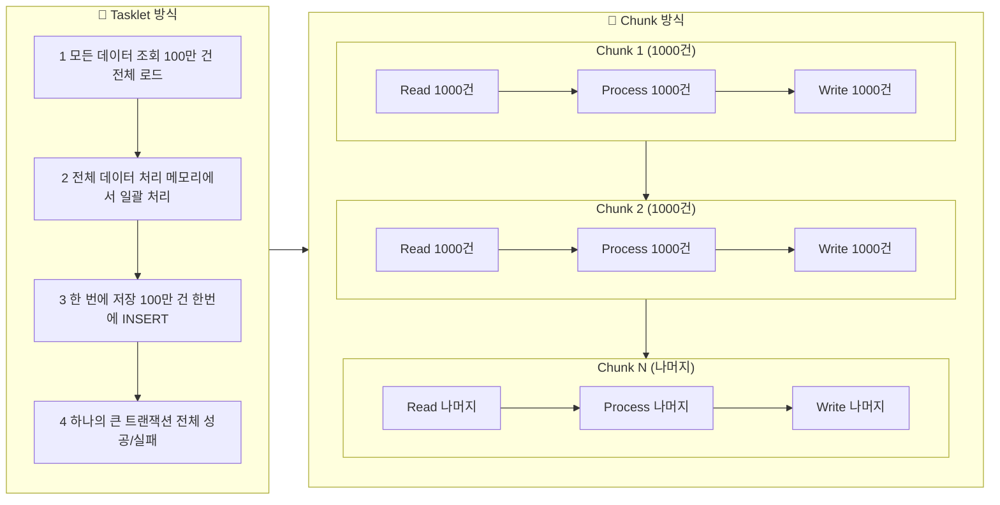
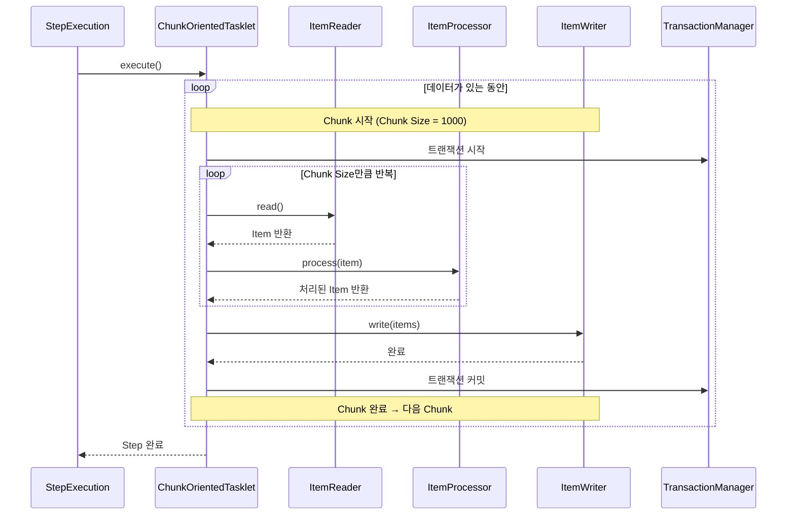
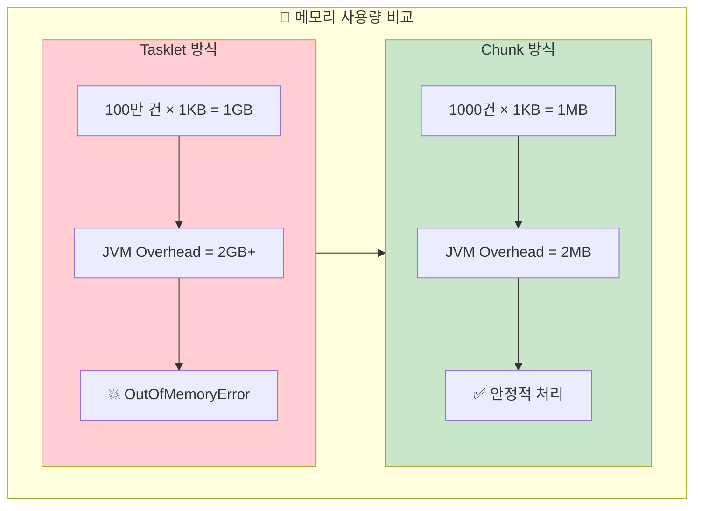
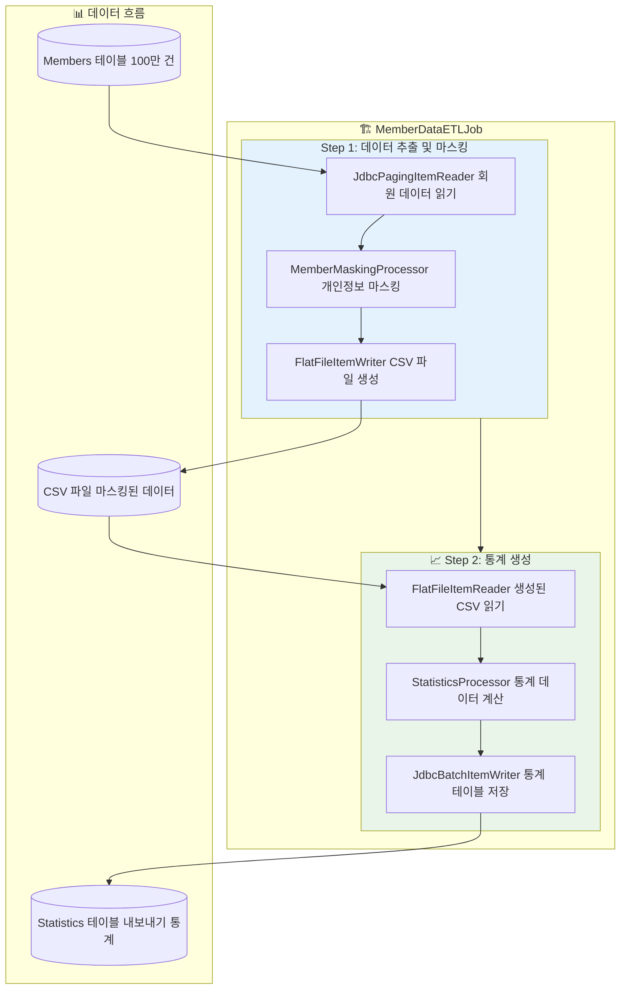
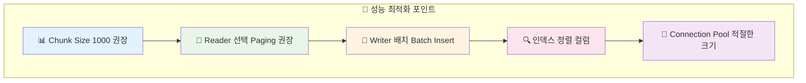
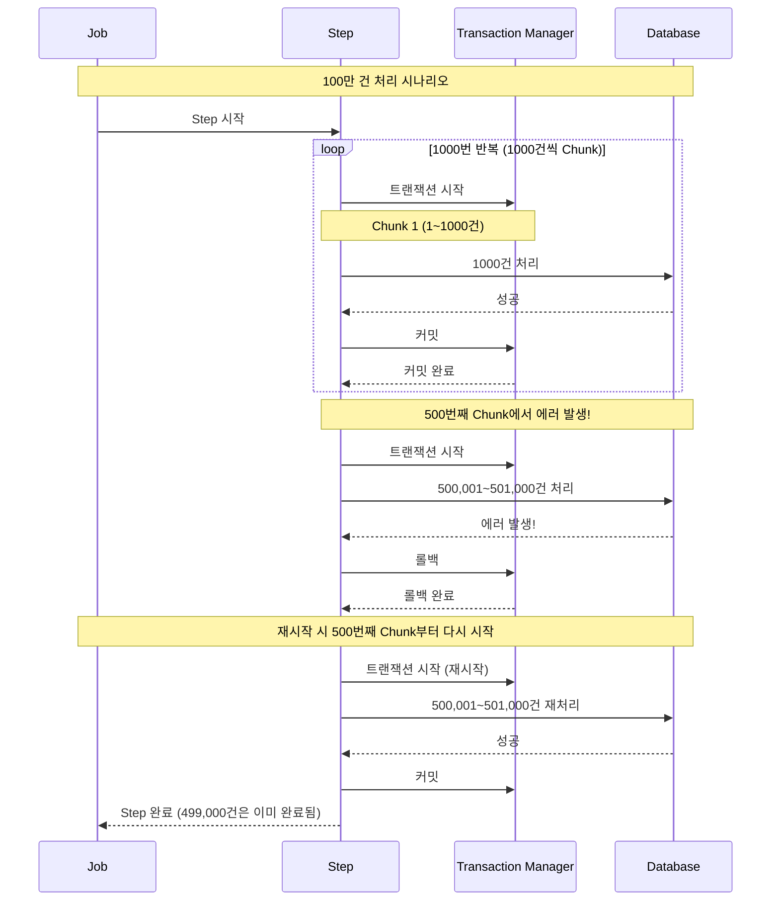

지난 Chapter 2에서 Job과 Step을 만들고 JobParameters를 사용해봤습니다. 이번에는 Spring Batch의 진짜 강력함을 느낄 수 있는 **Chunk 방식**을 배워보겠습니다! 100만 건의 데이터도 OutOfMemory 없이 안전하게 처리할 수 있는 비법을 공개합니다. 🚀

## 🎯 들어가며 - 실무 시나리오

새로 입사한 신입 개발자 B씨에게 이런 미션이 주어졌습니다.

> "우리 회사 회원이 100만 명인데, 개인정보보호법 때문에 회원 데이터를 마스킹 처리해서 CSV로 내보내야 해요. 매월 말에 정기적으로 해야 하는 작업이니까 배치로 만들어주세요!"

B씨는 지난번 공부한 Tasklet 방식으로 시도해봅니다.

```kotlin
@Bean
fun exportMemberTasklet(): Tasklet {
    return Tasklet { _, _ ->
        log.info("회원 데이터 내보내기 시작!")
        
        // 1. 모든 회원 조회
        val members = memberRepository.findAll() // 100만 건...
        
        // 2. 마스킹 처리
        val maskedMembers = members.map { member ->
            member.copy(
                email = maskEmail(member.email),
                phone = maskPhone(member.phone)
            )
        }
        
        // 3. CSV 생성
        createCsvFile(maskedMembers)
        
        RepeatStatus.FINISHED
    }
}
```

### 🤔 예상 가능한 문제들

#### 문제 1: "OutOfMemoryError: Java heap space"
- 100만 건을 한 번에 메모리에 올리면? 💥
- 8GB RAM도 부족할 수 있어요!

#### 문제 2: "처리 중간에 실패하면?"
- 80만 건 처리 후 에러 발생 → 처음부터 다시?
- 트랜잭션이 너무 커서 롤백도 오래 걸림

#### 문제 3: "처리 시간이 너무 오래"
- 순차 처리로 인한 성능 저하
- 데이터베이스 락킹 이슈

## 🎨 Chunk 방식의 마법

Spring Batch의 Chunk 방식은 이 모든 문제를 우아하게 해결합니다!

### Tasklet vs Chunk 방식 비교



### 🔥 Chunk 방식의 장점

| 구분 | Tasklet | Chunk |
|------|---------|-------|
| **메모리 사용량** | ❌ 전체 데이터 로드 | ✅ Chunk 크기만큼만 |
| **트랜잭션 크기** | ❌ 하나의 거대한 트랜잭션 | ✅ Chunk 단위로 분할 |
| **장애 복구** | ❌ 처음부터 재시작 | ✅ 실패한 Chunk부터 |
| **진행 상황 추적** | ❌ All or Nothing | ✅ Chunk별 진행률 |
| **성능** | ❌ 메모리 부족으로 느림 | ✅ 일정한 성능 유지 |

## 🏗️ Chunk 아키텍처 심화 분석

### Read-Process-Write 패턴



### 메모리 효율성의 비밀



## 📖 ItemReader - 데이터 읽기 마스터

ItemReader는 데이터 소스에서 하나씩 데이터를 읽어오는 역할을 합니다.

### 주요 ItemReader 구현체들

#### 1. JdbcCursorItemReader
```kotlin
@Bean
@StepScope
fun memberCursorReader(): JdbcCursorItemReader<Member> {
    return JdbcCursorItemReaderBuilder<Member>()
        .name("memberCursorReader")
        .dataSource(dataSource)
        .sql("""
            SELECT id, name, email, phone, created_date 
            FROM members 
            WHERE status = 'ACTIVE'
            ORDER BY id
        """)
        .rowMapper { rs, _ ->
            Member(
                id = rs.getLong("id"),
                name = rs.getString("name"),
                email = rs.getString("email"),
                phone = rs.getString("phone"),
                createdDate = rs.getTimestamp("created_date").toLocalDateTime()
            )
        }
        .build()
}
```

#### 2. JdbcPagingItemReader (추천!)
```kotlin
@Bean
@StepScope  
fun memberPagingReader(): JdbcPagingItemReader<Member> {
    return JdbcPagingItemReaderBuilder<Member>()
        .name("memberPagingReader")
        .dataSource(dataSource)
        .selectClause("SELECT id, name, email, phone, created_date")
        .fromClause("FROM members")
        .whereClause("WHERE status = 'ACTIVE'")
        .sortKeys(mapOf("id" to Order.ASCENDING))
        .pageSize(1000)  // 페이지 크기
        .rowMapper { rs, _ ->
            Member(
                id = rs.getLong("id"),
                name = rs.getString("name"),
                email = rs.getString("email"),
                phone = rs.getString("phone"),
                createdDate = rs.getTimestamp("created_date").toLocalDateTime()
            )
        }
        .build()
}
```

### 📊 JdbcCursor vs JdbcPaging 비교

| 구분 | JdbcCursorItemReader | JdbcPagingItemReader |
|------|---------------------|---------------------|
| **메모리 사용량** | ✅ 낮음 | ✅ 낮음 |
| **커넥션 유지** | ❌ Step 전체 동안 유지 | ✅ 페이지별로 해제 |
| **장애 복구** | ❌ 커서 위치 복구 어려움 | ✅ 페이지 번호로 복구 |
| **대용량 처리** | ⚠️ 커넥션 타임아웃 위험 | ✅ 안정적 |
| **정렬 보장** | ✅ ORDER BY 보장 | ✅ ORDER BY 필수 |

> 💡 **실무 권장**: 대용량 데이터에는 **JdbcPagingItemReader**를 사용하세요!

### 3. FlatFileItemReader (CSV 파일 읽기)
```kotlin
@Bean
@StepScope
fun csvFileReader(
    @Value("#{jobParameters['inputFile']}") inputFile: String
): FlatFileItemReader<MemberCsv> {
    return FlatFileItemReaderBuilder<MemberCsv>()
        .name("csvFileReader")
        .resource(FileSystemResource(inputFile))
        .delimited()
        .delimiter(",")
        .names("id", "name", "email", "phone")
        .fieldSetMapper { fieldSet ->
            MemberCsv(
                id = fieldSet.readLong("id"),
                name = fieldSet.readString("name"),
                email = fieldSet.readString("email"),
                phone = fieldSet.readString("phone")
            )
        }
        .linesToSkip(1)  // 헤더 스킵
        .build()
}
```

## 🔄 ItemProcessor - 데이터 변환 마스터

ItemProcessor는 읽은 데이터를 비즈니스 로직에 따라 변환하는 역할입니다.

### 기본 ItemProcessor 구현

```kotlin
@Component
class MemberMaskingProcessor : ItemProcessor<Member, MaskedMember> {
    
    companion object {
        private val log = LoggerFactory.getLogger(MemberMaskingProcessor::class.java)
    }
    
    override fun process(item: Member): MaskedMember? {
        return try {
            MaskedMember(
                id = item.id,
                name = maskName(item.name),
                email = maskEmail(item.email),
                phone = maskPhone(item.phone),
                createdDate = item.createdDate
            )
        } catch (e: Exception) {
            log.error("회원 마스킹 처리 실패: ${item.id}", e)
            null  // null 반환 시 해당 아이템은 skip됨
        }
    }
    
    private fun maskName(name: String): String {
        return when {
            name.length <= 2 -> name
            name.length == 3 -> "${name.first()}*${name.last()}"
            else -> "${name.first()}${"*".repeat(name.length - 2)}${name.last()}"
        }
    }
    
    private fun maskEmail(email: String): String {
        val atIndex = email.indexOf("@")
        if (atIndex <= 1) return email
        
        val username = email.substring(0, atIndex)
        val domain = email.substring(atIndex)
        val maskedUsername = username.first() + "*".repeat(username.length - 1)
        
        return maskedUsername + domain
    }
    
    private fun maskPhone(phone: String): String {
        val digits = phone.replace(Regex("[^0-9]"), "")
        return when {
            digits.length == 11 -> "${digits.substring(0, 3)}-****-${digits.substring(7)}"
            digits.length == 10 -> "${digits.substring(0, 3)}-***-${digits.substring(6)}"
            else -> phone
        }
    }
}
```

### 복합 Processor 체인 구성

```kotlin
@Bean
fun compositeProcessor(): CompositeItemProcessor<Member, ExportableMember> {
    val processor = CompositeItemProcessor<Member, ExportableMember>()
    
    processor.setDelegates(listOf(
        validationProcessor(),    // 1단계: 유효성 검사
        maskingProcessor(),       // 2단계: 마스킹 처리
        transformProcessor()      // 3단계: 내보내기 형태로 변환
    ))
    
    return processor
}

@Bean
fun validationProcessor(): ItemProcessor<Member, Member> {
    return ItemProcessor { member ->
        when {
            member.email.isBlank() -> {
                log.warn("이메일이 없는 회원: ${member.id}")
                null  // Skip
            }
            !isValidEmail(member.email) -> {
                log.warn("잘못된 이메일 형식: ${member.email}")
                null  // Skip
            }
            else -> member
        }
    }
}
```

### 필터링과 Skip 전략

```kotlin
@Component
class FilteringItemProcessor : ItemProcessor<Member, Member> {
    
    override fun process(item: Member): Member? {
        return when {
            // 탈퇴 회원 제외
            item.status == MemberStatus.WITHDRAWN -> null
            
            // 개인정보 제공 동의하지 않은 회원 제외
            !item.privacyAgreed -> null
            
            // 마케팅 수신 동의한 회원만 포함
            item.marketingAgreed -> item
            
            else -> null
        }
    }
}
```

## 💾 ItemWriter - 데이터 저장 마스터

ItemWriter는 처리된 데이터를 최종 목적지에 저장하는 역할입니다.

### 1. JdbcBatchItemWriter
```kotlin
@Bean
fun memberBatchWriter(): JdbcBatchItemWriter<MaskedMember> {
    return JdbcBatchItemWriterBuilder<MaskedMember>()
        .dataSource(dataSource)
        .sql("""
            INSERT INTO masked_members (id, name, email, phone, export_date)
            VALUES (:id, :name, :email, :phone, :exportDate)
        """)
        .beanMapped()  // 객체 필드를 자동으로 매핑
        .build()
}
```

### 2. FlatFileItemWriter (CSV 생성)
```kotlin
@Bean
@StepScope
fun csvFileWriter(
    @Value("#{jobParameters['outputFile']}") outputFile: String
): FlatFileItemWriter<MaskedMember> {
    return FlatFileItemWriterBuilder<MaskedMember>()
        .name("csvFileWriter")
        .resource(FileSystemResource(outputFile))
        .delimited()
        .delimiter(",")
        .names("id", "name", "email", "phone", "exportDate")
        .headerCallback { writer ->
            writer.write("ID,이름,이메일,전화번호,내보내기날짜")
        }
        .build()
}
```

### 3. CompositeItemWriter (다중 저장)
```kotlin
@Bean
fun compositeWriter(): CompositeItemWriter<MaskedMember> {
    val writer = CompositeItemWriter<MaskedMember>()
    
    writer.setDelegates(listOf(
        csvFileWriter(),      // CSV 파일로 저장
        databaseWriter(),     // 데이터베이스에도 저장
        auditLogWriter()      // 감사 로그 기록
    ))
    
    return writer
}
```

## 🎯 실전 프로젝트: 100만 회원 데이터 ETL

이제 모든 개념을 종합해서 실제 프로젝트를 만들어봅시다!

### 프로젝트 구조



### Job Configuration

```kotlin
@Configuration
class MemberDataETLJobConfig(
    private val jobRepository: JobRepository,
    private val transactionManager: PlatformTransactionManager
) {
    
    companion object {
        private val log = LoggerFactory.getLogger(MemberDataETLJobConfig::class.java)
    }
    
    @Bean
    fun memberDataETLJob(
        memberExportStep: Step,
        statisticsStep: Step
    ): Job {
        return JobBuilder("memberDataETLJob", jobRepository)
            .incrementer(RunIdIncrementer())
            .start(memberExportStep)
            .next(statisticsStep)
            .listener(jobExecutionListener())
            .build()
    }
    
    @Bean
    fun jobExecutionListener(): JobExecutionListener {
        return object : JobExecutionListener {
            override fun beforeJob(jobExecution: JobExecution) {
                val outputFile = jobExecution.jobParameters.getString("outputFile")
                log.info("🚀 회원 데이터 ETL 시작! 출력 파일: $outputFile")
            }
            
            override fun afterJob(jobExecution: JobExecution) {
                if (jobExecution.status == BatchStatus.COMPLETED) {
                    val duration = Duration.between(
                        jobExecution.startTime,
                        jobExecution.endTime
                    )
                    log.info("✅ ETL 완료! 소요시간: ${duration.toMinutes()}분")
                } else {
                    log.error("❌ ETL 실패: ${jobExecution.allFailureExceptions}")
                }
            }
        }
    }
}
```

### Step 1: 회원 데이터 내보내기

```kotlin
@Configuration
class MemberExportStepConfig(
    private val jobRepository: JobRepository,
    private val transactionManager: PlatformTransactionManager,
    private val dataSource: DataSource
) {
    
    @Bean
    fun memberExportStep(): Step {
        return StepBuilder("memberExportStep", jobRepository)
            .chunk<Member, MaskedMember>(1000, transactionManager)  // Chunk Size: 1000
            .reader(memberPagingReader())
            .processor(memberMaskingProcessor())
            .writer(csvFileWriter())
            .faultTolerant()
            .skipPolicy(ExceptionSkipPolicy())
            .listener(stepExecutionListener())
            .build()
    }
    
    @Bean
    @StepScope
    fun memberPagingReader(): JdbcPagingItemReader<Member> {
        return JdbcPagingItemReaderBuilder<Member>()
            .name("memberPagingReader")
            .dataSource(dataSource)
            .selectClause("SELECT id, name, email, phone, status, created_date")
            .fromClause("FROM members")
            .whereClause("WHERE status = 'ACTIVE' AND privacy_agreed = true")
            .sortKeys(mapOf("id" to Order.ASCENDING))
            .pageSize(1000)
            .rowMapper { rs, _ ->
                Member(
                    id = rs.getLong("id"),
                    name = rs.getString("name"),
                    email = rs.getString("email"),
                    phone = rs.getString("phone"),
                    status = MemberStatus.valueOf(rs.getString("status")),
                    createdDate = rs.getTimestamp("created_date").toLocalDateTime()
                )
            }
            .build()
    }
    
    @Bean
    @StepScope
    fun csvFileWriter(
        @Value("#{jobParameters['outputFile']}") outputFile: String?
    ): FlatFileItemWriter<MaskedMember> {
        val fileName = outputFile ?: "member_export_${LocalDate.now()}.csv"
        
        return FlatFileItemWriterBuilder<MaskedMember>()
            .name("csvFileWriter")
            .resource(FileSystemResource(fileName))
            .delimited()
            .delimiter(",")
            .names("id", "name", "email", "phone", "exportDate")
            .headerCallback { writer ->
                writer.write("회원ID,이름,이메일,전화번호,내보내기날짜")
            }
            .shouldDeleteIfExists(true)  // 기존 파일 덮어쓰기
            .build()
    }
    
    @Bean
    fun stepExecutionListener(): StepExecutionListener {
        return object : StepExecutionListener {
            override fun beforeStep(stepExecution: StepExecution) {
                log.info("📊 회원 데이터 내보내기 Step 시작")
            }
            
            override fun afterStep(stepExecution: StepExecution): ExitStatus? {
                log.info("✅ 처리 완료 - 읽기: ${stepExecution.readCount}, " +
                        "쓰기: ${stepExecution.writeCount}, " +
                        "스킵: ${stepExecution.skipCount}")
                return null
            }
        }
    }
}
```

## 📊 Chunk Size 최적화 전략

Chunk Size는 성능에 큰 영향을 미치는 중요한 설정입니다.

### Chunk Size별 성능 벤치마킹

| Chunk Size | 처리 시간 | 메모리 사용량 | 트랜잭션 수 | 권장 용도 |
|------------|----------|--------------|------------|----------|
| 100 | 15분 | 낮음 | 10,000개 | 복잡한 비즈니스 로직 |
| 500 | 12분 | 보통 | 2,000개 | 일반적인 데이터 처리 |
| **1000** | **10분** | **보통** | **1,000개** | **균형잡힌 선택 (권장)** |
| 2000 | 9분 | 높음 | 500개 | 단순한 데이터 변환 |
| 5000 | 8분 | 매우 높음 | 200개 | 메모리 충분한 환경 |

### 동적 Chunk Size 조정

```kotlin
@Component
class DynamicChunkSizePolicy {
    
    fun calculateOptimalChunkSize(
        dataSize: Long,
        availableMemory: Long,
        itemSize: Int
    ): Int {
        val baseChunkSize = 1000
        
        return when {
            // 소량 데이터
            dataSize < 10_000 -> minOf(baseChunkSize, dataSize.toInt())
            
            // 메모리 부족
            availableMemory < 512 * 1024 * 1024 -> baseChunkSize / 2  // 500
            
            // 메모리 충분
            availableMemory > 2 * 1024 * 1024 * 1024 -> baseChunkSize * 2  // 2000
            
            // 기본값
            else -> baseChunkSize
        }
    }
}
```

### 성능 최적화 체크리스트



## 🛡️ 트랜잭션과 재시작 전략

### Chunk 단위 트랜잭션의 장점



### 재시작 설정

```kotlin
@Bean
fun memberExportStep(): Step {
    return StepBuilder("memberExportStep", jobRepository)
        .chunk<Member, MaskedMember>(1000, transactionManager)
        .reader(memberPagingReader())
        .processor(memberMaskingProcessor())
        .writer(csvFileWriter())
        .faultTolerant()
        .retryLimit(3)  // 재시도 3번
        .retry(DataAccessException::class.java)
        .skipLimit(100)  // 최대 100건 스킵 허용
        .skip(ValidationException::class.java)
        .noSkip(DataIntegrityViolationException::class.java)  // 데이터 무결성 에러는 스킵 불가
        .build()
}
```

## 🔍 모니터링과 진행률 추적

### Step Execution 정보 활용

```kotlin
@RestController
@RequestMapping("/api/batch/monitor")
class BatchMonitorController(
    private val jobExplorer: JobExplorer
) {
    
    @GetMapping("/progress/{executionId}")
    fun getProgress(@PathVariable executionId: Long): BatchProgressResponse {
        val jobExecution = jobExplorer.getJobExecution(executionId)
            ?: throw IllegalArgumentException("Job execution not found")
        
        val stepExecutions = jobExecution.stepExecutions.map { step ->
            val progressPercentage = if (step.status == BatchStatus.COMPLETED) {
                100.0
            } else {
                // Chunk 기반 진행률 계산
                val totalChunks = (step.readCount + step.chunkSize - 1) / step.chunkSize
                val completedChunks = step.commitCount
                if (totalChunks > 0) (completedChunks.toDouble() / totalChunks) * 100 else 0.0
            }
            
            StepProgressInfo(
                stepName = step.stepName,
                status = step.status.toString(),
                readCount = step.readCount,
                writeCount = step.writeCount,
                skipCount = step.skipCount,
                chunkSize = step.chunkSize,
                commitCount = step.commitCount,
                rollbackCount = step.rollbackCount,
                progressPercentage = progressPercentage,
                estimatedTimeRemaining = calculateRemainingTime(step)
            )
        }
        
        return BatchProgressResponse(
            jobName = jobExecution.jobInstance.jobName,
            status = jobExecution.status.toString(),
            startTime = jobExecution.startTime,
            steps = stepExecutions
        )
    }
    
    private fun calculateRemainingTime(step: StepExecution): Duration? {
        if (step.readCount <= 0 || step.status == BatchStatus.COMPLETED) return null
        
        val elapsedTime = Duration.between(step.startTime, LocalDateTime.now())
        val itemsPerSecond = step.readCount.toDouble() / elapsedTime.seconds
        
        // 추정 총 아이템 수 (실제로는 더 정확한 계산 필요)
        val estimatedTotalItems = step.readCount * 2  // 임시 추정
        val remainingItems = estimatedTotalItems - step.readCount
        
        return if (itemsPerSecond > 0) {
            Duration.ofSeconds((remainingItems / itemsPerSecond).toLong())
        } else null
    }
}
```

## 🚨 트러블슈팅 가이드

### 1. OutOfMemoryError 해결

```kotlin
// ❌ 문제 코드
@Bean
fun badReader(): JpaPagingItemReader<Member> {
    return JpaPagingItemReaderBuilder<Member>()
        .name("badReader")
        .entityManagerFactory(entityManagerFactory)
        .queryString("SELECT m FROM Member m")
        .pageSize(10000)  // 너무 큰 페이지 크기!
        .build()
}

// ✅ 개선 코드
@Bean
fun goodReader(): JdbcPagingItemReader<Member> {
    return JdbcPagingItemReaderBuilder<Member>()
        .name("goodReader")
        .dataSource(dataSource)  // JDBC 사용으로 메모리 효율성 향상
        .selectClause("SELECT id, name, email, phone")
        .fromClause("FROM members")
        .sortKeys(mapOf("id" to Order.ASCENDING))
        .pageSize(1000)  // 적절한 페이지 크기
        .build()
}
```

### 2. 성능 저하 원인 분석

```kotlin
@Component
class PerformanceProfiler : ChunkListener {
    
    private var chunkStartTime: LocalDateTime? = null
    
    override fun beforeChunk(context: ChunkContext) {
        chunkStartTime = LocalDateTime.now()
    }
    
    override fun afterChunk(context: ChunkContext) {
        val duration = Duration.between(chunkStartTime, LocalDateTime.now())
        val stepExecution = context.stepContext.stepExecution
        
        if (duration.seconds > 10) {  // 10초 이상 걸린 청크
            log.warn("⚠️ 느린 청크 감지! " +
                    "청크 번호: ${stepExecution.commitCount}, " +
                    "소요시간: ${duration.seconds}초")
        }
        
        // 성능 메트릭 수집
        collectMetrics(stepExecution, duration)
    }
    
    private fun collectMetrics(stepExecution: StepExecution, duration: Duration) {
        val itemsPerSecond = if (duration.seconds > 0) {
            stepExecution.chunkSize.toDouble() / duration.seconds
        } else 0.0
        
        log.info("📊 청크 성능 - 처리속도: ${String.format("%.2f", itemsPerSecond)} items/sec")
    }
}
```

### 3. 데이터베이스 락킹 이슈

```kotlin
@Configuration
class OptimizedDataSourceConfig {
    
    @Bean
    @Primary
    fun optimizedDataSource(): DataSource {
        val config = HikariConfig()
        config.jdbcUrl = "jdbc:h2:mem:batchdb"
        config.driverClassName = "org.h2.Driver"
        config.username = "sa"
        config.password = ""
        
        // 배치 처리 최적화 설정
        config.maximumPoolSize = 10  // 적절한 커넥션 풀 크기
        config.minimumIdle = 2
        config.connectionTimeout = 30000  // 30초
        config.idleTimeout = 600000  // 10분
        config.maxLifetime = 1800000  // 30분
        
        // 배치 처리용 추가 설정
        config.addDataSourceProperty("cachePrepStmts", "true")
        config.addDataSourceProperty("prepStmtCacheSize", "250")
        config.addDataSourceProperty("prepStmtCacheSqlLimit", "2048")
        
        return HikariDataSource(config)
    }
}
```

## 🎯 정리

Spring Batch의 Chunk 방식을 완전히 마스터했습니다! 🎉

### ✅ 핵심 정리

1. **Chunk 방식의 핵심**
   - Read-Process-Write 패턴으로 메모리 효율적 처리
   - Chunk 단위 트랜잭션으로 안정성 확보
   - 실패 시 Chunk 단위로 재시작 가능

2. **ItemReader 선택 기준**
   - 대용량: JdbcPagingItemReader (추천)
   - 연속 처리: JdbcCursorItemReader
   - 파일: FlatFileItemReader

3. **성능 최적화 포인트**
   - Chunk Size: 1000 권장
   - 적절한 커넥션 풀 설정
   - 정렬 컬럼에 인덱스 필수

4. **장애 대응**
   - Skip과 Retry 정책 설정
   - 상세한 로깅과 모니터링
   - 진행률 추적으로 사용자 경험 향상

### 🚀 다음 시간 예고

다음 Chapter 4에서는 **병렬 처리와 파티셔닝**을 배워보겠습니다!

- Multi-threaded Step으로 처리 속도 향상
- Partitioning으로 대용량 데이터 분산 처리
- Remote Partitioning과 마스터-슬레이브 패턴
- 실제 성능 비교와 최적화 전략

100만 건도 이제 부족해요! 1000만 건, 1억 건도 빠르게 처리할 수 있는 고급 기법들을 알아보겠습니다! 😎

---
