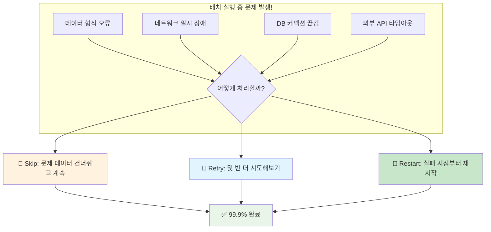
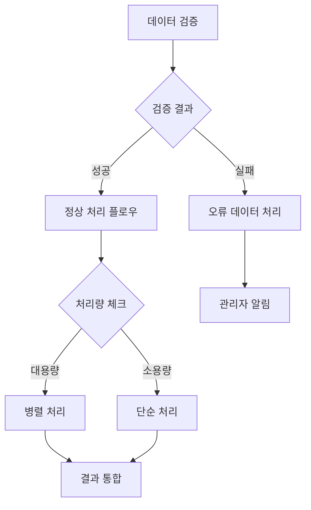

지난 Chapter 4에서 병렬 처리로 1000만 건을 1시간 만에 처리하는 방법을 배웠습니다. 하지만 실무에서는 더 큰 도전이 기다리고 있어요! **"배치가 99% 완료되었는데 실패했어요... 처음부터 다시 해야 하나요?"** 😱

이번 Chapter에서는 Spring Batch의 **Skip, Retry, Restart** 전략으로 배치를 안전하고 견고하게 만드는 방법을 알아보겠습니다! 🚀

## 🎯 들어가며 - 새벽 3시의 악몽 시나리오

신입 개발자 C씨에게 운명의 전화가 걸려왔습니다. 📞

> "C씨! 큰일났어요! 어제 밤에 돌린 회원 데이터 마이그레이션 배치가 새벽 2시 50분에 실패했는데, 800만 건 중 790만 건 처리했다가 실패한 거예요. 오늘 오전 9시까지 완료되어야 하는데... 어떻게 하면 좋을까요?" 😭

C씨가 확인해보니 이런 상황이었습니다:

```kotlin
// C씨가 만든 기존 배치
@Bean
fun memberMigrationStep(): Step {
    return StepBuilder("memberMigrationStep", jobRepository)
        .chunk<OldMember, NewMember>(10000, transactionManager)
        .reader(oldMemberReader())
        .processor(memberProcessor())  // 여기서 실패!
        .writer(newMemberWriter())
        .build()
}
```

### 🤔 문제 상황 분석

| 시간 | 진행률 | 처리된 데이터 | 상황 |
|------|--------|-------------|------|
| 22:00 | 0% | 0건 | 배치 시작 ✅ |
| 01:00 | 40% | 320만 건 | 순조롭게 진행 ✅ |
| 02:30 | 90% | 720만 건 | 거의 완료! ✅ |
| 02:50 | **99%** | **790만 건** | ❌ **갑자기 실패!** |

**실패 원인**: 일부 회원 데이터에 이메일 형식 오류 → Exception 발생 → 전체 배치 중단

C씨: "790만 건을 처음부터 다시 처리해야 하나요? 시간이 없는데..." 🤦‍♂️

## 🛡️ Spring Batch의 3가지 방어 전략

Spring Batch는 이런 상황을 위해 강력한 내결함성(Fault Tolerance) 기능을 제공합니다!



### 🎯 전략 비교표

| 전략 | 언제 사용? | 장점 | 주의사항 | 실무 사용도 |
|------|-----------|------|----------|------------|
| **Skip** | 일부 데이터 오류 | 빠른 처리 | 데이터 손실 | ⭐⭐⭐⭐⭐ |
| **Retry** | 일시적 장애 | 높은 성공률 | 처리 시간 증가 | ⭐⭐⭐⭐ |
| **Restart** | 시스템 장애 | 효율적 복구 | 설정 복잡 | ⭐⭐⭐⭐⭐ |

---

## 🦘 Part 1: Skip 전략 - "이 데이터는 건너뛰고 계속 진행!"

### 🎯 Skip이 필요한 실무 상황

**케이스 1**: 1000만 건 중 10건의 이메일 형식 오류
- "완벽한 데이터는 없다" - 80/20 법칙
- 10건 때문에 990만 건을 못 처리할 순 없어요!

**케이스 2**: CSV 파일 import 시 일부 라인 깨짐
- 파일 전송 과정에서 몇 줄이 깨진 경우
- 전체를 재전송받기보다 건너뛰고 처리

### 💻 실습: C씨의 회원 마이그레이션 배치 개선하기

#### Step 1: 문제가 되는 기존 코드
```kotlin
// 🚨 문제: 하나라도 실패하면 전체 중단
@Bean
fun memberMigrationStep(): Step {
    return StepBuilder("memberMigrationStep", jobRepository)
        .chunk<OldMember, NewMember>(10000, transactionManager)
        .reader(oldMemberReader())
        .processor(memberProcessor())  // 여기서 Exception 시 전체 실패
        .writer(newMemberWriter())
        .build()
}

@Component
class MemberProcessor : ItemProcessor<OldMember, NewMember> {
    
    override fun process(item: OldMember): NewMember {
        // 이메일 검증 - 실패 시 Exception!
        if (!isValidEmail(item.email)) {
            throw IllegalArgumentException("Invalid email: ${item.email}")
        }
        
        return NewMember(
            id = item.id,
            name = item.name,
            email = item.email,
            // ... 기타 필드
        )
    }
    
    private fun isValidEmail(email: String): Boolean {
        return email.contains("@") && email.contains(".")
    }
}
```

#### Step 2: Skip 전략 적용 🛡️
```kotlin
// ✅ 해결: Skip으로 문제 데이터 건너뛰고 계속 처리
@Bean
fun memberMigrationStep(): Step {
    return StepBuilder("memberMigrationStep", jobRepository)
        .chunk<OldMember, NewMember>(10000, transactionManager)
        .reader(oldMemberReader())
        .processor(memberProcessor())
        .writer(newMemberWriter())
        .faultTolerant()                              // 🔥 내결함성 활성화
        .skip(IllegalArgumentException::class.java)    // 🔥 Skip 대상 예외
        .skip(ValidationException::class.java)         // 🔥 여러 예외 지정 가능
        .skipLimit(1000)                              // 🔥 최대 1000건까지 Skip 허용
        .skipPolicy(customSkipPolicy())               // 🔥 커스텀 Skip 정책 (선택)
        .listener(skipListener())                     // 🔥 Skip 이벤트 리스너
        .build()
}
```

#### Step 3: Skip 이벤트 모니터링 📊
```kotlin
@Component
class SkipListener : SkipListener<OldMember, NewMember> {
    
    private val logger = LoggerFactory.getLogger(this::class.java)
    private val skipCounter = AtomicInteger(0)
    
    override fun onSkipInProcess(item: OldMember, t: Throwable) {
        val currentSkipCount = skipCounter.incrementAndGet()
        
        logger.warn("Skip 발생! 회원 ID: ${item.id}, 이유: ${t.message}")
        
        // 🔥 실시간 모니터링
        if (currentSkipCount % 100 == 0) {
            logger.warn("⚠️ Skip 누적 ${currentSkipCount}건 도달!")
            
            // Slack 알림 발송
            slackNotifier.sendAlert(
                "🚨 배치 Skip 알림",
                "회원 마이그레이션에서 ${currentSkipCount}건 Skip 발생\n" +
                "마지막 Skip 회원: ${item.id}"
            )
        }
    }
}
```

### 🔧 고급 Skip 설정

#### 1. 커스텀 Skip 정책
```kotlin
@Component
class CustomSkipPolicy : SkipPolicy {
    
    override fun shouldSkip(t: Throwable, skipCount: Long): Boolean {
        return when {
            // 데이터 형식 오류는 Skip
            t is IllegalArgumentException -> true
            t is ValidationException -> true
            
            // DB 관련 오류는 Skip 하지 않음 (Retry로 처리)
            t is DataAccessException -> false
            
            // Skip 횟수 제한
            skipCount >= 1000 -> false
            
            else -> false
        }
    }
}
```

#### 2. Skip된 데이터 별도 저장
```kotlin
@Component
class SkipListener : SkipListener<OldMember, NewMember> {
    
    @Autowired
    private lateinit var skipDataRepository: SkipDataRepository
    
    override fun onSkipInProcess(item: OldMember, t: Throwable) {
        // Skip된 데이터를 별도 테이블에 저장
        val skipRecord = SkipRecord(
            originalId = item.id,
            originalData = objectMapper.writeValueAsString(item),
            skipReason = t.message,
            skipTime = LocalDateTime.now()
        )
        
        skipDataRepository.save(skipRecord)
    }
}
```

---

## 🔄 Part 2: Retry 전략 - "다시 한번 시도해보자!"

### 🎯 Retry가 효과적인 상황

**케이스 1**: 외부 API 일시적 타임아웃
- "잠깐만... 다시 해보면 될 것 같은데?"
- 1-2초 후 재시도하면 90% 성공

**케이스 2**: DB 커넥션 풀 부족
- 동시 접속자 많을 때 일시적 현상
- 조금 기다렸다 재시도하면 OK

### 💻 실습: 외부 API 연동 배치 (결제 정보 동기화)

#### 시나리오
> "결제 서비스 API에서 회원별 결제 정보를 가져와서 우리 DB에 동기화하는 배치를 만들어주세요. 근데 가끔 API가 불안정해서 타임아웃이 발생해요."

#### Step 1: Retry 없는 기존 코드 (문제)
```kotlin
// 🚨 문제: API 한번 실패하면 해당 청크 전체 실패
@Bean
fun paymentSyncStep(): Step {
    return StepBuilder("paymentSyncStep", jobRepository)
        .chunk<Member, PaymentInfo>(100, transactionManager)
        .reader(memberReader())
        .processor(paymentSyncProcessor())  // API 호출 실패 시 전체 실패
        .writer(paymentInfoWriter())
        .build()
}

@Component
class PaymentSyncProcessor : ItemProcessor<Member, PaymentInfo> {
    
    @Autowired
    private lateinit var paymentApiClient: PaymentApiClient
    
    override fun process(item: Member): PaymentInfo? {
        // API 호출 - 실패 시 Exception!
        return paymentApiClient.getPaymentInfo(item.id)  // 타임아웃 발생 가능
    }
}
```

#### Step 2: Retry 전략 적용 🔄
```kotlin
// ✅ 해결: Retry로 일시적 장애 극복
@Bean
fun paymentSyncStep(): Step {
    return StepBuilder("paymentSyncStep", jobRepository)
        .chunk<Member, PaymentInfo>(100, transactionManager)
        .reader(memberReader())
        .processor(paymentSyncProcessor())
        .writer(paymentInfoWriter())
        .faultTolerant()
        .retry(ConnectTimeoutException::class.java)      // 🔥 재시도 대상 예외
        .retry(ReadTimeoutException::class.java)
        .retry(SocketTimeoutException::class.java)
        .retryLimit(3)                                   // 🔥 최대 3회 재시도
        .backOffPolicy(exponentialBackOffPolicy())       // 🔥 지수 백오프
        .retryListener(retryListener())                  // 🔥 재시도 이벤트 리스너
        .build()
}
```

#### Step 3: 백오프 정책 설정 ⏰
```kotlin
@Bean
fun exponentialBackOffPolicy(): BackOffPolicy {
    return ExponentialBackOffPolicy().apply {
        initialInterval = 1000L        // 첫 재시도: 1초 후
        multiplier = 2.0              // 두 번째: 2초, 세 번째: 4초
        maxInterval = 10000L          // 최대 10초까지
        maxElapsedTime = 30000L       // 총 30초 내에서만 재시도
    }
}

// 고정 간격 백오프도 가능
@Bean
fun fixedBackOffPolicy(): BackOffPolicy {
    return FixedBackOffPolicy().apply {
        backOffPeriod = 2000L  // 항상 2초 후 재시도
    }
}
```

### 🔧 고급 Retry 패턴

#### 1. 재시도 로직 모니터링
```kotlin
@Component
class RetryListener : RetryListener {
    
    private val logger = LoggerFactory.getLogger(this::class.java)
    
    override fun <T, E : Throwable> onError(
        context: RetryContext,
        callback: RetryCallback<T, E>,
        throwable: Throwable
    ) {
        logger.warn(
            "재시도 ${context.retryCount}회 실패: ${throwable.message}"
        )
        
        // 재시도 패턴 분석
        if (context.retryCount >= 2) {
            logger.error("⚠️ 재시도 2회 이상 실패! 외부 시스템 점검 필요")
            
            // 외부 시스템 상태 체크
            healthCheckService.checkExternalSystem()
        }
    }
}
```

#### 2. Circuit Breaker 패턴 적용
```kotlin
@Component
class PaymentSyncProcessor : ItemProcessor<Member, PaymentInfo> {
    
    private val circuitBreaker = CircuitBreaker.create()
    
    override fun process(item: Member): PaymentInfo? {
        return circuitBreaker.call {
            paymentApiClient.getPaymentInfo(item.id)
        }
    }
}

// Circuit Breaker 설정
@Bean
fun circuitBreaker(): CircuitBreaker {
    return CircuitBreaker.create().apply {
        failureThreshold = 5        // 5번 실패하면 열림
        successThreshold = 3        // 3번 성공하면 닫힘
        delay = Duration.ofSeconds(10)  // 10초 후 Half-Open
    }
}
```

---

## 🚀 Part 3: Restart 전략 - "실패한 지점부터 다시 시작!"

### 🎯 실무 Restart 시나리오

**케이스 1**: 5시간 배치가 4시간 30분에 실패
- "처음부터 다시 하면 또 5시간..." 😭
- 실패 지점부터 재시작하면 30분만 더!

**케이스 2**: 시스템 재부팅으로 배치 중단
- 서버 업데이트로 인한 예상된 재부팅
- 재부팅 후 이어서 처리

### 💻 실습: 대용량 주문 데이터 집계 배치

#### 시나리오
> "전국 매장의 1년치 주문 데이터 5000만 건을 분석해서 매출 리포트를 만들어야 해요. 근데 중간에 실패하면 처음부터 다시 하기엔 너무 오래 걸려요..."

#### Step 1: Restart 가능한 Job 설계
```kotlin
@Bean
fun salesAnalysisJob(): Job {
    return JobBuilder("salesAnalysisJob", jobRepository)
        .incrementer(RunIdIncrementer())                 // 🔥 Job 식별자 자동 증가
        .start(dataPreprocessingStep())                  // 전처리
        .next(salesCalculationStep())                    // 매출 계산 (메인)
        .next(reportGenerationStep())                    // 리포트 생성
        .listener(salesJobListener())                    // 🔥 Job 이벤트 리스너
        .build()
}

@Bean
fun salesCalculationStep(): Step {
    return StepBuilder("salesCalculationStep", jobRepository)
        .chunk<OrderData, SalesData>(10000, transactionManager)
        .reader(orderDataReader())
        .processor(salesCalculationProcessor())
        .writer(salesDataWriter())
        .startLimit(5)                                   // 🔥 최대 5번까지 재시작 허용
        .allowStartIfComplete(false)                     // 🔥 완료된 Step은 재실행 안함
        .listener(salesStepListener())
        .build()
}
```

#### Step 2: JobRepository 메타데이터 활용
```kotlin
@Component
class SalesJobListener : JobExecutionListener {
    
    private val logger = LoggerFactory.getLogger(this::class.java)
    
    override fun beforeJob(jobExecution: JobExecution) {
        val jobParameters = jobExecution.jobParameters
        val restartFlag = jobParameters.getString("restart", "false")
        
        if (restartFlag == "true") {
            logger.info("🔄 재시작 모드로 Job 실행")
            
            // 이전 실행 정보 조회
            val previousExecution = findPreviousExecution(jobExecution)
            previousExecution?.let {
                logger.info("이전 실행 정보: ${it.status}, 실패 시점: ${it.endTime}")
            }
        } else {
            logger.info("🆕 새로운 Job 실행")
        }
    }
    
    override fun afterJob(jobExecution: JobExecution) {
        when (jobExecution.status) {
            BatchStatus.COMPLETED -> {
                logger.info("✅ Job 성공 완료!")
                // 성공 알림
                notificationService.sendSuccessAlert(jobExecution)
            }
            BatchStatus.FAILED -> {
                logger.error("❌ Job 실패!")
                // 재시작 가이드 제공
                provideRestartGuidance(jobExecution)
            }
        }
    }
    
    private fun provideRestartGuidance(jobExecution: JobExecution) {
        val failedStep = jobExecution.stepExecutions
            .firstOrNull { it.status == BatchStatus.FAILED }
        
        logger.error("""
            🔄 재시작 방법:
            1. 실패한 Step: ${failedStep?.stepName}
            2. 재시작 명령어: 
               java -jar batch.jar --job.name=salesAnalysisJob --restart=true
            3. 예상 재시작 시간: ${calculateRestartTime(jobExecution)}분
        """.trimIndent())
    }
}
```

#### Step 3: 재시작 최적화
```kotlin
@Component
class OrderDataReader : ItemReader<OrderData> {
    
    private var currentPosition = 0L
    
    override fun read(): OrderData? {
        // ExecutionContext에서 마지막 처리 위치 복원
        val executionContext = stepExecution.executionContext
        if (currentPosition == 0L) {
            currentPosition = executionContext.getLong("reader.position", 0L)
            logger.info("🔄 재시작: ${currentPosition}번째 레코드부터 처리")
        }
        
        val orderData = readNextOrderData(currentPosition)
        
        if (orderData != null) {
            currentPosition++
            // 주기적으로 현재 위치 저장 (재시작 최적화)
            if (currentPosition % 10000 == 0L) {
                executionContext.putLong("reader.position", currentPosition)
            }
        }
        
        return orderData
    }
}
```

### 🗄️ JobRepository 메타데이터 분석

#### Batch 메타데이터 테이블 구조
```sql
-- Job 실행 이력
SELECT 
    job_execution_id,
    job_name,
    status,
    start_time,
    end_time,
    exit_code
FROM BATCH_JOB_EXECUTION 
WHERE job_name = 'salesAnalysisJob'
ORDER BY start_time DESC;

-- Step 별 실행 상세
SELECT 
    step_name,
    status,
    read_count,
    write_count,
    commit_count,
    rollback_count,
    read_skip_count,
    process_skip_count,
    write_skip_count
FROM BATCH_STEP_EXECUTION 
WHERE job_execution_id = ?;
```

#### 재시작 자동화 스크립트
```kotlin
@Service
class BatchRestartService {
    
    @Autowired
    private lateinit var jobLauncher: JobLauncher
    
    @Autowired
    private lateinit var jobRepository: JobRepository
    
    fun autoRestart(jobName: String, originalJobExecutionId: Long) {
        val originalExecution = jobRepository.getJobExecution(originalJobExecutionId)
        
        if (originalExecution?.status == BatchStatus.FAILED) {
            val restartParameters = JobParametersBuilder(originalExecution.jobParameters)
                .addString("restart", "true")
                .addLong("timestamp", System.currentTimeMillis())  // 유니크 보장
                .toJobParameters()
            
            logger.info("🔄 자동 재시작 실행: $jobName")
            jobLauncher.run(getJob(jobName), restartParameters)
        }
    }
}
```

---

## 🎛️ Part 4: 통합 전략 - Skip + Retry + Restart 조합

### 💻 실습: 완벽한 내결함성 배치 만들기

#### 시나리오
> "모든 것을 고려한 완벽한 배치를 만들어보세요! 데이터 오류도 있고, 네트워크도 불안정하고, 가끔 시스템도 재시작되고..."

```kotlin
@Configuration
class RobustBatchConfig {
    
    @Bean
    fun robustDataProcessingJob(): Job {
        return JobBuilder("robustDataProcessingJob", jobRepository)
            .incrementer(RunIdIncrementer())
            .start(validationStep())                     // 1단계: 데이터 검증
            .next(dataProcessingStep())                  // 2단계: 메인 처리
            .next(summaryStep())                         // 3단계: 결과 요약
            .listener(robustJobListener())
            .build()
    }
    
    @Bean
    fun dataProcessingStep(): Step {
        return StepBuilder("dataProcessingStep", jobRepository)
            .chunk<RawData, ProcessedData>(5000, transactionManager)
            .reader(dataReader())
            .processor(dataProcessor())
            .writer(dataWriter())
            .faultTolerant()
            
            // 🦘 Skip 설정: 데이터 형식 오류
            .skip(DataFormatException::class.java)
            .skip(ValidationException::class.java)
            .skipLimit(1000)                             // 최대 1000건 Skip
            .skipPolicy(intelligentSkipPolicy())
            
            // 🔄 Retry 설정: 일시적 장애
            .retry(TransientDataAccessException::class.java)
            .retry(ConnectTimeoutException::class.java)
            .retry(SocketTimeoutException::class.java)
            .retryLimit(3)                               // 최대 3회 재시도
            .backOffPolicy(smartBackOffPolicy())
            
            // 🚀 Restart 설정
            .startLimit(5)                               // 최대 5번 재시작
            .allowStartIfComplete(false)
            
            // 📊 모니터링
            .listener(comprehensiveStepListener())
            .build()
    }
}
```

### 🧠 지능형 정책 구현

#### 1. 상황별 Skip 정책
```kotlin
@Component
class IntelligentSkipPolicy : SkipPolicy {
    
    private val skipCounts = mutableMapOf<String, AtomicInteger>()
    
    override fun shouldSkip(t: Throwable, skipCount: Long): Boolean {
        val exceptionType = t::class.simpleName ?: "Unknown"
        val currentCount = skipCounts.computeIfAbsent(exceptionType) { AtomicInteger(0) }
        
        return when {
            // 데이터 품질 이슈: 제한적 Skip
            t is DataFormatException -> {
                currentCount.incrementAndGet() <= 500
            }
            
            // 비즈니스 로직 오류: 더 관대한 Skip
            t is ValidationException -> {
                currentCount.incrementAndGet() <= 1000
            }
            
            // 시스템 오류: Skip 하지 말고 Retry로 처리
            t is DataAccessException -> false
            
            // 전체 Skip 한도 체크
            skipCount >= 2000 -> false
            
            else -> false
        }
    }
}
```

#### 2. 적응형 백오프 정책
```kotlin
@Component
class SmartBackOffPolicy : BackOffPolicy {
    
    private val retryHistory = mutableListOf<Long>()
    
    override fun start(context: BackOffContext): BackOffContext {
        return context
    }
    
    override fun backOff(backOffContext: BackOffContext) {
        val currentTime = System.currentTimeMillis()
        retryHistory.add(currentTime)
        
        // 최근 재시도 패턴 분석
        val recentRetries = retryHistory.filter { currentTime - it < 60000 } // 최근 1분
        
        val backOffTime = when {
            recentRetries.size <= 3 -> 1000L      // 적은 재시도: 1초
            recentRetries.size <= 10 -> 3000L     // 보통: 3초
            else -> 10000L                        // 많은 재시도: 10초 (시스템 부하 고려)
        }
        
        logger.info("🔄 적응형 백오프: ${backOffTime}ms 대기")
        Thread.sleep(backOffTime)
    }
}
```

### 🎯 전략 조합 매트릭스

| 데이터/시스템 유형 | Skip 정책 | Retry 정책 | Restart 정책 | 비고 |
|------------------|-----------|------------|-------------|------|
| **사용자 로그** | 관대함 (10%) | 제한적 (2회) | 허용 | 손실 허용 |
| **주문 데이터** | 엄격함 (1%) | 적극적 (5회) | 허용 | 정확성 중요 |
| **금융 거래** | 금지 (0%) | 매우 적극적 (10회) | 제한적 | 무결성 최우선 |
| **통계/집계** | 보통 (5%) | 보통 (3회) | 허용 | 근사치 허용 |

---

## 📊 Part 5: 모니터링과 알림 - "문제를 미리 알아차리자"

### 🔔 실무 모니터링 시스템 구현

#### 1. 종합 모니터링 리스너
```kotlin
@Component
class ComprehensiveStepListener : StepExecutionListener, SkipListener<Any, Any>, RetryListener {
    
    private val metrics = mutableMapOf<String, Any>()
    
    override fun beforeStep(stepExecution: StepExecution): ExitStatus? {
        metrics["startTime"] = System.currentTimeMillis()
        logger.info("📊 Step 시작: ${stepExecution.stepName}")
        return null
    }
    
    override fun afterStep(stepExecution: StepExecution): ExitStatus {
        val endTime = System.currentTimeMillis()
        val startTime = metrics["startTime"] as Long
        val duration = endTime - startTime
        
        // 핵심 메트릭 수집
        val stepMetrics = StepMetrics(
            stepName = stepExecution.stepName,
            readCount = stepExecution.readCount,
            writeCount = stepExecution.writeCount,
            skipCount = stepExecution.skipCount,
            retryCount = stepExecution.rollbackCount,
            duration = duration,
            status = stepExecution.status
        )
        
        // 🚨 임계치 기반 알림
        checkAndAlert(stepMetrics)
        
        // 📈 메트릭 저장 (모니터링 DB/Elasticsearch)
        metricsRepository.save(stepMetrics)
        
        return stepExecution.exitStatus
    }
    
    private fun checkAndAlert(metrics: StepMetrics) {
        when {
            // Skip 비율이 5% 초과
            metrics.skipRate > 0.05 -> {
                alertService.sendAlert(
                    level = AlertLevel.WARNING,
                    title = "⚠️ Skip 비율 높음",
                    message = "Skip 비율: ${metrics.skipRate * 100}%"
                )
            }
            
            // 처리 시간이 예상보다 2배 이상
            metrics.duration > expectedDuration * 2 -> {
                alertService.sendAlert(
                    level = AlertLevel.WARNING,
                    title = "🐌 처리 시간 지연",
                    message = "예상: ${expectedDuration}ms, 실제: ${metrics.duration}ms"
                )
            }
            
            // Retry가 너무 많음
            metrics.retryCount > 100 -> {
                alertService.sendAlert(
                    level = AlertLevel.ERROR,
                    title = "🔄 과도한 재시도",
                    message = "재시도 횟수: ${metrics.retryCount}회"
                )
            }
        }
    }
}
```

#### 2. 실시간 대시보드 데이터
```kotlin
@RestController
class BatchMonitoringController {
    
    @GetMapping("/api/batch/metrics/{jobName}")
    fun getJobMetrics(@PathVariable jobName: String): JobMetricsResponse {
        val currentExecution = getCurrentJobExecution(jobName)
        
        return JobMetricsResponse(
            jobName = jobName,
            status = currentExecution?.status?.name,
            progress = calculateProgress(currentExecution),
            skipCount = currentExecution?.stepExecutions?.sumOf { it.skipCount } ?: 0,
            retryCount = currentExecution?.stepExecutions?.sumOf { it.rollbackCount } ?: 0,
            estimatedTimeRemaining = calculateETA(currentExecution),
            healthStatus = determineHealthStatus(currentExecution)
        )
    }
    
    private fun determineHealthStatus(execution: JobExecution?): HealthStatus {
        execution ?: return HealthStatus.UNKNOWN
        
        val totalSkips = execution.stepExecutions.sumOf { it.skipCount }
        val totalReads = execution.stepExecutions.sumOf { it.readCount }
        val skipRate = if (totalReads > 0) totalSkips.toDouble() / totalReads else 0.0
        
        return when {
            skipRate > 0.1 -> HealthStatus.CRITICAL  // 10% 이상 Skip
            skipRate > 0.05 -> HealthStatus.WARNING  // 5% 이상 Skip  
            execution.status == BatchStatus.FAILED -> HealthStatus.CRITICAL
            execution.status == BatchStatus.STARTED -> HealthStatus.HEALTHY
            else -> HealthStatus.UNKNOWN
        }
    }
}
```

#### 3. Slack 알림 통합
```kotlin
@Service
class SlackAlertService {
    
    @Value("\${slack.webhook.url}")
    private lateinit var webhookUrl: String
    
    fun sendBatchAlert(
        level: AlertLevel,
        jobName: String, 
        message: String,
        metrics: Map<String, Any>? = null
    ) {
        val color = when (level) {
            AlertLevel.INFO -> "#36a64f"      // 초록
            AlertLevel.WARNING -> "#ff9500"   // 주황  
            AlertLevel.ERROR -> "#ff0000"     // 빨강
        }
        
        val slackMessage = SlackMessage(
            text = "${getEmoji(level)} 배치 알림: $jobName",
            attachments = listOf(
                SlackAttachment(
                    color = color,
                    fields = listOf(
                        SlackField("상태", level.name, true),
                        SlackField("Job명", jobName, true),
                        SlackField("메시지", message, false)
                    ) + createMetricFields(metrics)
                )
            )
        )
        
        // Webhook 전송
        restTemplate.postForObject(webhookUrl, slackMessage, String::class.java)
    }
    
    private fun getEmoji(level: AlertLevel): String = when (level) {
        AlertLevel.INFO -> "✅"
        AlertLevel.WARNING -> "⚠️" 
        AlertLevel.ERROR -> "🚨"
    }
}
```

---

## 🚀 Part 6: 실무 장애 대응 시나리오

### 🎯 시나리오 1: "Skip 횟수가 갑자기 급증했어요!"

#### 상황
```
평소 패턴: 1시간에 10건 내외 Skip
오늘 상황: 30분 만에 1000건 Skip! 😱
```

#### 대응 체크리스트
```kotlin
// 1단계: 즉시 중단 판단
if (skipCount > normalSkipCount * 10) {
    logger.error("🚨 비정상적 Skip 급증! 배치 중단 검토")
    
    // 긴급 중단 여부 결정
    if (skipRate > 0.2) {  // 20% 이상
        stopJobExecution()
        sendEmergencyAlert()
    }
}

// 2단계: 원인 분석
fun analyzeSkipSpike() {
    // 최근 Skip된 데이터 샘플 분석
    val recentSkips = getRecentSkippedData(limit = 100)
    val skipReasons = recentSkips.groupBy { it.reason }
    
    logger.info("Skip 원인 분석:")
    skipReasons.forEach { (reason, occurrences) ->
        logger.info("- $reason: ${occurrences.size}건")
    }
    
    // 데이터 소스 점검 신호
    if (skipReasons.size == 1) {
        logger.warn("⚠️ 단일 원인으로 인한 Skip 급증 - 데이터 소스 점검 필요")
    }
}
```

#### 실무 대응 절차
1. **즉시 대응** (5분 내)
   - 배치 상태 확인
   - Skip 패턴 분석
   - 긴급 중단 여부 결정

2. **원인 분석** (30분 내)
   - 업스트림 데이터 변경 여부 확인
   - 비즈니스 로직 변경 이력 검토
   - 외부 시스템 상태 점검

3. **해결 조치** (1시간 내)
   - 임시 Skip 정책 조정
   - 데이터 품질 개선
   - 배치 재시작

### 🎯 시나리오 2: "재시작해도 같은 지점에서 계속 실패해요!"

#### 상황
```
실패 지점: OrderProcessor.process() 라인 45
재시작 3번 모두 같은 곳에서 실패
특정 Order ID: 12345678에서 반복 실패
```

#### 대응 코드
```kotlin
@Component
class ProblemDataHandler {
    
    // 문제 데이터 격리
    fun isolateProblematicData(orderId: Long) {
        logger.info("🔒 문제 데이터 격리: Order ID $orderId")
        
        // 1. 원본 데이터를 별도 테이블로 이동
        val orderData = orderRepository.findById(orderId)
        problematicDataRepository.save(
            ProblematicData(
                originalId = orderId,
                data = orderData,
                reason = "반복 실패",
                isolatedAt = LocalDateTime.now()
            )
        )
        
        // 2. 원본에서 임시 제외 (소프트 삭제)
        orderRepository.markAsProblematic(orderId)
        
        logger.info("✅ 데이터 격리 완료. 배치 재시작 가능")
    }
    
    // 해당 청크 건너뛰기
    fun skipProblematicChunk(stepExecution: StepExecution, problematicId: Long) {
        val executionContext = stepExecution.executionContext
        
        // 문제 ID 기록
        val skippedIds = executionContext.get("skipped.ids") as MutableSet<Long>? 
            ?: mutableSetOf()
        skippedIds.add(problematicId)
        executionContext.put("skipped.ids", skippedIds)
        
        logger.info("⏭️ 문제 청크 건너뛰기 설정: $problematicId")
    }
}
```

#### 실무 대응 절차
1. **즉시 격리** (10분 내)
   - 문제 데이터 식별
   - 별도 테이블로 격리
   - 배치 재시작

2. **근본 원인 분석** (1시간 내)
   - 데이터 내용 상세 분석
   - 비즈니스 로직 검토
   - 예외 케이스 파악

3. **영구 해결** (1일 내)
   - 비즈니스 로직 개선
   - 데이터 검증 강화
   - 예외 처리 추가

### 🎯 시나리오 3: "배치가 너무 자주 재시작돼요!"

#### 상황
```
1일 재시작 횟수: 15회
평균 실행 시간: 30분 → 8시간
원인: 시스템 불안정으로 인한 빈번한 중단
```

#### 시스템 안정성 개선
```kotlin
@Component
class BatchStabilityManager {
    
    private val restartHistory = mutableListOf<RestartEvent>()
    
    fun shouldDelayRestart(): Boolean {
        val now = LocalDateTime.now()
        val recentRestarts = restartHistory.filter { 
            it.timestamp.isAfter(now.minusHours(1)) 
        }
        
        return when {
            recentRestarts.size >= 5 -> {
                logger.warn("🛑 1시간 내 5회 재시작 - 30분 대기")
                true
            }
            recentRestarts.size >= 3 -> {
                logger.warn("⏰ 1시간 내 3회 재시작 - 10분 대기")
                true  
            }
            else -> false
        }
    }
    
    fun optimizeForStability(stepBuilder: StepBuilder<*, *>) {
        stepBuilder
            .chunk(2000, transactionManager)  // 청크 크기 축소
            .taskExecutor(stabilityTaskExecutor())  // 안정성 우선 실행자
            .throttleLimit(10)  // 처리율 제한
    }
    
    @Bean
    fun stabilityTaskExecutor(): TaskExecutor {
        return ThreadPoolTaskExecutor().apply {
            corePoolSize = 2      // 기본보다 적은 스레드
            maxPoolSize = 4       // 최대도 제한
            queueCapacity = 1000  // 큰 큐로 버퍼링
            setThreadNamePrefix("stable-batch-")
        }
    }
}
```

---

## 🏆 마무리 - 안전한 배치 운영의 핵심 포인트

### ✅ 내결함성 배치 설계 체크리스트

#### 🦘 Skip 전략
- [ ] **Skip 대상 예외 명확히 정의** (데이터 품질 vs 시스템 오류)
- [ ] **Skip 한도 설정** (데이터 유형별 차등 적용)
- [ ] **Skip된 데이터 별도 보관** (나중에 분석/재처리 가능)
- [ ] **Skip 패턴 모니터링** (급증 시 알림)

#### 🔄 Retry 전략  
- [ ] **재시도 대상 예외 구분** (일시적 vs 영구적 오류)
- [ ] **백오프 정책 설정** (지수 vs 고정 간격)
- [ ] **재시도 횟수 제한** (무한 루프 방지)
- [ ] **외부 시스템 고려** (Circuit Breaker 적용)

#### 🚀 Restart 전략
- [ ] **재시작 포인트 설정** (Step 단위 재시작)
- [ ] **ExecutionContext 활용** (진행 상황 저장)
- [ ] **재시작 횟수 제한** (무한 재시작 방지)  
- [ ] **재시작 자동화** (운영 효율성)

#### 📊 모니터링 & 알림
- [ ] **핵심 메트릭 수집** (Skip/Retry/처리속도)
- [ ] **임계치 기반 알림** (Slack/이메일)
- [ ] **실시간 대시보드** (운영팀 가시성)
- [ ] **장애 대응 플레이북** (신속한 대응)

### 🎯 실무 적용 가이드

#### 데이터 유형별 전략 매트릭스
```kotlin
// 로그 데이터: 관대한 정책
.skipLimit(10000)           // 1% Skip 허용
.retryLimit(2)             // 최소한의 재시도
.allowStartIfComplete(true) // 재시작 허용

// 금융 데이터: 엄격한 정책  
.skipLimit(0)              // Skip 금지
.retryLimit(10)            // 적극적 재시도
.allowStartIfComplete(false) // 완료된 것은 재실행 안함

// 일반 비즈니스 데이터: 균형잡힌 정책
.skipLimit(1000)           // 제한적 Skip
.retryLimit(3)             // 적당한 재시도
.allowStartIfComplete(false) // 중복 실행 방지
```

### 💡 Key Takeaways

1. **완벽한 배치는 없다** - 실패를 전제로 설계하라
2. **데이터 유형별 차등 적용** - 로그 ≠ 금융 데이터
3. **모니터링이 핵심** - 문제를 미리 발견하라
4. **자동화된 대응** - 새벽 3시에도 안심
5. **문서화된 대응 절차** - 누구나 대응 가능하게

### 🚀 다음 Chapter 예고

**Chapter 6: 조건부 실행과 플로우 제어 - 복잡한 배치 워크플로우 설계**



- Step 간 조건부 실행 (ExitStatus 활용)
- Split Flow로 병렬 Step 실행  
- Nested Job과 Job Chaining
- 실무 워크플로우 패턴

이제 여러분도 새벽 3시 장애 전화가 와도 당황하지 않고 차근차근 대응할 수 있을 거예요! 💪

---

**"배치가 실패하는 것은 당연하다. 중요한 것은 어떻게 안전하게 복구하느냐이다."** 🛡️

C씨도 이제 안전한 배치 운영의 달인이 되었습니다! 다음 Chapter에서 더 고급 기능들을 만나보세요! 🚀